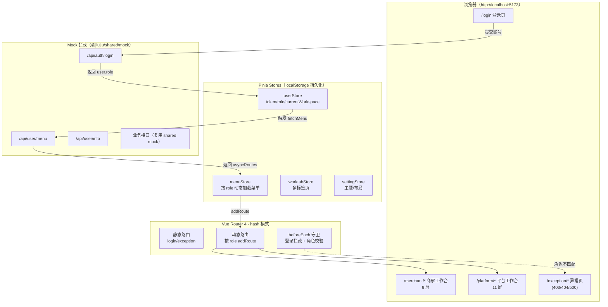

# DESIGN · 管理后台合并（admin-pc）

> 6A 工作流 · 阶段 2：Architect（架构阶段）
> 上游：`CONSENSUS_admin-pc-merge.md`

---

## 1. 整体架构



### 关键设计点

| 点 | 选择 | 理由 |
|---|---|---|
| 路由模式 | hash | 部署免后端配 try_files |
| 角色感知 | 后端下发菜单 + 前端守卫双保险 | menu 解决菜单显示，守卫解决越权访问 |
| 工作台切换 | localStorage + menuStore.refetch + router.replace | 不刷整页，体验顺滑 |
| 主题覆盖 | 仅改 SCSS 主色变量 + tokens.css | 不动整体灰阶布局 |
| 持久化 | pinia-plugin-persistedstate（已配）| 框架开箱即用 |

---

## 2. 分层设计

```mermaid
graph LR
  subgraph View层
    V1[views/auth/login]
    V2[views/merchant/*]
    V3[views/platform/*]
    V4[views/exception/*]
  end

  subgraph Component层
    C1[components/core/topbar/<br/>WorkspaceSwitcher]
    C2[layouts<br/>(art-lnb 原有)]
    C3[art-* 业务组件库]
  end

  subgraph Composables层
    H1[hooks/useAuth]
    H2[hooks/useWorkspace]
  end

  subgraph Store层
    S1[userStore]
    S2[menuStore]
    S3[worktabStore]
  end

  subgraph Service层
    A1[api/auth.ts]
    A2[api/menu.ts]
    A3[api/system-manage.ts]
  end

  subgraph Util层
    U1[utils/http<br/>Axios 拦截器]
    U2[utils/router]
    U3[utils/storage]
  end

  V1 --> H1
  V2 --> C2
  V3 --> C2
  C2 --> C1
  C1 --> H2
  H1 --> S1
  H1 --> A1
  H2 --> S1
  H2 --> S2
  S2 --> A2
  A1 --> U1
  A2 --> U1
  S1 --> U3
```

---

## 3. 模块依赖

```mermaid
graph TD
  ADMIN[@jiujiu/admin-pc]
  SHARED[@jiujiu/shared]

  ADMIN -->|workspace:*| SHARED
  ADMIN -->|element-plus| EP[Element Plus]
  ADMIN -->|vue 3.5| VUE[Vue]
  ADMIN -->|pinia 3| PINIA[Pinia]
  ADMIN -->|vue-router 4| ROUTER[Vue Router]
  ADMIN -->|axios| AX[Axios]
  ADMIN -->|echarts 6| EC[ECharts]
  ADMIN -->|tailwindcss 4| TW[Tailwind]

  SHARED --> MOCK[mock/]
  SHARED --> TYPES[types/]
  SHARED --> FACTORY[mock/factory/<br/>product/order/merchant/...]
```

`@jiujiu/admin-pc` 与移动端 3 包通过 `@jiujiu/shared` 共享类型与 mock 数据，保证数据口径一致。

---

## 4. 接口契约

### 4.1 登录

```http
POST /api/auth/login
Content-Type: application/json

{ "username": "merchant@demo", "password": "123456" }
```

**响应**

```json
{
  "code": 200,
  "data": {
    "accessToken": "mock-token-merchant-1234",
    "refreshToken": "mock-refresh-merchant-5678",
    "user": {
      "userId": "u-001",
      "username": "merchant@demo",
      "nickname": "王老板",
      "avatar": "https://...",
      "role": "merchant"
    }
  }
}
```

### 4.2 获取菜单

```http
GET /api/user/menu?role=merchant
Authorization: Bearer <accessToken>
```

**响应**：`AppRouteRecord[]` 数组，结构由 art-lnb 现有 `types/router` 决定，按 role 返回 9 屏 / 11 屏 / 全部。

### 4.3 获取用户详情

```http
GET /api/user/info
```

**响应**：同 4.1 的 `user` 字段。

---

## 5. 数据流向

```mermaid
sequenceDiagram
  actor U as 用户
  participant L as Login.vue
  participant US as userStore
  participant MS as menuStore
  participant R as Router
  participant M as Mock 拦截器

  U->>L: 输入账号密码 + 点击登录
  L->>M: POST /api/auth/login
  M-->>L: { accessToken, user: { role: 'merchant' } }
  L->>US: setToken + setUserInfo(role)
  L->>MS: fetchMenu(role)
  MS->>M: GET /api/user/menu?role=merchant
  M-->>MS: AppRouteRecord[]（仅 /merchant/*）
  MS->>R: addRoute(asyncRoutes)
  L->>R: push('/merchant/dashboard')
  R-->>U: 渲染商家工作台

  Note over U,R: 超管切换工作台
  U->>+US: WorkspaceSwitcher → switchWorkspace('platform')
  US->>MS: refetch('platform')
  MS->>R: removeRoute + addRoute(platform routes)
  US->>R: replace('/platform/dashboard')
  R-->>-U: 切换到平台工作台
```

---

## 6. 异常处理策略

| 异常 | 处理 | 提示 |
|---|---|---|
| 用户名/密码错 | mock 返回 401 | ElNotification 提示"账号或密码错误" |
| token 过期（mock 暂不触发） | 401 触发 logOut → 跳 `/login?redirect=...` | 全局 axios 错误拦截器已有 |
| 跨角色访问 | beforeEach 拦截 → `/exception/403` | art-lnb 自带 403 页 |
| 路由不存在 | router 兜底 → `/exception/404` | 已有 |
| 菜单接口失败 | 重试一次，仍败则 logOut | 防止半残登录态 |
| 超管切换工作台失败 | 不切换，恢复原 currentWorkspace，弹错误 | UX 一致性 |

---

## 7. 视觉与品牌

| 项 | 值 | 落点 |
|---|---|---|
| 主题色 | `#FF4D2D`（5.0 商城品牌橙） | `assets/styles/variables.scss` 覆盖 `$el-color-primary` |
| Logo 文字 | "经纬科技" | `src/config/index.ts` 中 `systemInfo.name` |
| 浏览器标题 | "经纬科技" | `index.html` + `setPageTitle` |
| Favicon | 暂沿用 art-lnb 默认 | `public/favicon.svg` |
| 登录页副标题 | "商家 / 平台一体化管理控制台" | i18n 中文键 |

---

## 8. 不动的部分（防止过度设计）

- art-lnb 自带的 `setting / locale / lock-screen / search-history / worktab` 全部**保留原样**
- art-lnb 的 `_examples` 仅**全量删除**，不挑选保留
- 默认 dashboard 模板（`views/dashboard/console`）作为 merchant / platform dashboard 的**视觉参考**，但页面级 `.vue` 文件独立创建于 `views/merchant/dashboard/` 和 `views/platform/dashboard/`，不复用同一个文件
- 路由 routesAlias、guards/afterEach、http 拦截器、表单工具不动
- 富文本、xlsx、图表库等依赖留着不删

---

## 9. 风险与降级

| 风险 | 降级 |
|---|---|
| menuStore.refetch + 动态 addRoute 在 hash 模式下可能有缓存 | 失败时强制 `location.reload()` 兜底 |
| 接 `@jiujiu/shared` 后 Pinia v3 与 v2 共存可能 hooks 冲突 | admin-pc 独立 node_modules，已隔离 |
| 删旧包后根 package.json 脚本失效 | 同步删 `dev:merchant-pc` / `dev:platform-pc` 脚本 |
| art-lnb 删 _examples 后某些路由模块仍 import | 全文搜 import + 同步删 router/modules/_examples |
