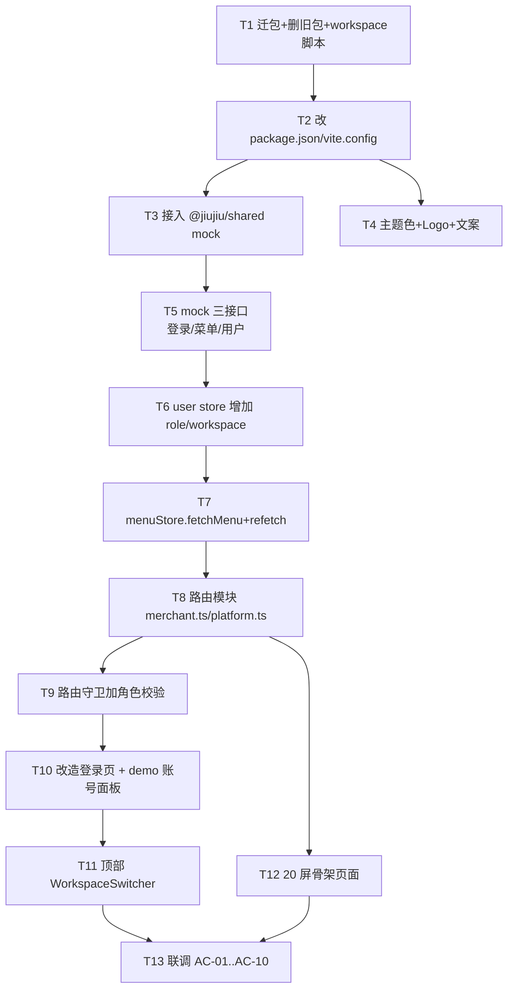

# TASK · 管理后台合并（admin-pc）

> 6A 工作流 · 阶段 3：Atomize（原子化阶段）
> 上游：`DESIGN_admin-pc-merge.md`

---

## 依赖图



---

## T1 · 迁包 + 删旧包 + workspace 脚本

**输入契约**：根目录有 `art-lnb-master/` + `packages/merchant-pc/` + `packages/platform-pc/`
**输出契约**：
- `packages/admin-pc/` 存在（由 art-lnb-master 整体迁入）
- `packages/merchant-pc/`、`packages/platform-pc/`、根 `art-lnb-master/` 全部不存在
- 根 `package.json` 新增 `"dev:admin-pc": "pnpm --filter @jiujiu/admin-pc dev"`，移除 `dev:merchant-pc` / `dev:platform-pc`
**验收**：`ls packages/` 输出含 `admin-pc`，不含 `merchant-pc` 与 `platform-pc`
**约束**：用 Windows PowerShell `Move-Item` 或 Bash `mv`，保持文件 mtime

---

## T2 · 包元信息改造

**输入**：`packages/admin-pc/` 存在
**输出**：
- `package.json` `name` → `@jiujiu/admin-pc`，加 `"@jiujiu/shared": "workspace:*"` 依赖
- `vite.config.ts` 加 `server.port = 5173`、`@shared` alias
**验收**：`pnpm install` 成功；`pnpm --filter @jiujiu/admin-pc dev` 能起 5173

---

## T3 · 接入 @jiujiu/shared mock

**输入**：T2 完成
**输出**：
- `src/main.ts` 导入 `registerMockRoutes(mockRoutes)` from `@jiujiu/shared/mock`
- 删除 art-lnb 自带 `src/mock/` 的 `_examples` 部分，保留拦截器骨架
**验收**：浏览器 console 看到 mock 注册日志，无报错

---

## T4 · 主题色 + Logo + 文案

**输入**：T2 完成
**输出**：
- `src/assets/styles/variables.scss` 加 `$primary: #FF4D2D` 等
- `src/config/index.ts` `systemInfo.name = "经纬科技"`
- `index.html` `<title>` 改 "经纬科技"
**验收**：浏览器标题 + 登录页 logo 文字正确，主按钮变橙

---

## T5 · Mock 三接口

**输入**：T3 完成
**输出**：在 `packages/shared/src/mock/extra-routes/admin-pc.ts`（新文件）或现有 mock 路由表中追加：
- `POST /api/auth/login` 命中 3 个 demo 账号，返回 `{ accessToken, user: { role } }`
- `GET /api/user/menu?role=X` 返回对应角色的 asyncRoutes
- `GET /api/user/info` 按 token 回查用户
**验收**：用 fetch 三个接口都能拿到正确数据

---

## T6 · user store 扩展

**输入**：T5 完成
**输出**：`src/store/modules/user.ts` 增加：
- `role: ComputedRef<UserRole>`（从 `info.role` 派生）
- `currentWorkspace: Ref<'merchant' | 'platform'>`（localStorage 持久化）
- `setCurrentWorkspace(target)` action
**验收**：单元 hook 可读到 role、能 set/get workspace

---

## T7 · menuStore 支持按 role 重拉

**输入**：T6 完成
**输出**：`src/store/modules/menu.ts` 增加 `fetchMenu(role)`、`refetch(workspace)` 方法
- `fetchMenu` 调 `/api/user/menu`，写入 store
- `refetch` 先 removeRoute 再 addRoute
**验收**：登录后菜单按 role 显示；超管切工作台菜单实时变化

---

## T8 · 路由模块 merchant.ts + platform.ts

**输入**：T7 完成
**输出**：
- `src/router/modules/merchant.ts`：9 屏路由定义（dashboard / product-list / product-add / product-category / product-agency-list / order-list / order-aftersale / customer-list / marketing）
- `src/router/modules/platform.ts`：11 屏路由定义（dashboard / audit-merchant / audit-product / ad / plaza / member-plan / member-pay-orders / permission / system / feature-flag / data-center）
- 在 `src/router/routes/asyncRoutes.ts` 聚合时区分两组
**验收**：登录后地址栏粘 `/merchant/dashboard` 等 20 个 URL，全部可访问

---

## T9 · 路由守卫角色校验

**输入**：T8 完成
**输出**：`src/router/guards/beforeEach.ts` 加：
```ts
const isMerchantUrl = to.path.startsWith('/merchant/')
const isPlatformUrl = to.path.startsWith('/platform/')
if (isMerchantUrl && userStore.role === 'platform') return next('/exception/403')
if (isPlatformUrl && userStore.role === 'merchant') return next('/exception/403')
```
**验收**：商家账号粘贴 `/platform/audit/merchant` → 跳 403

---

## T10 · 改造登录页 + demo 账号面板

**输入**：T6 + T7 完成
**输出**：`src/views/auth/login/index.vue`：
- 删除 i18n 切换、注册链接（保留找回密码）
- 提交逻辑：login → setUserInfo → fetchMenu → push(homeMap)
- 底部加 `<ElCollapse>` "测试账号"，3 张卡片，点击一键填充
**验收**：3 个 demo 账号一键登录都正确跳工作台

---

## T11 · WorkspaceSwitcher（顶部超管切换器）

**输入**：T6 + T7 完成
**输出**：
- 新建 `src/components/core/topbar/WorkspaceSwitcher.vue`：`<ElDropdown>`，仅 `role === 'super-admin'` 渲染
- 下拉项：`【🏬 商家工作台】` / `【🛠 平台工作台】`，当前态高亮
- 插入到 art-lnb 顶部 NavBar（一般在 `layouts/components/menu-top` 之类的位置，找到现有用户头像旁边即可）
**验收**：超管登录后顶部能看到切换器；切换后菜单 + 路由实时变化

---

## T12 · 20 屏骨架页面

**输入**：T8 完成
**输出**：20 个 `.vue` 文件，每个：
- 顶部 PageHeader（标题 + 面包屑）
- 中间一行"该页面属于 X 工作台 · 详细业务待 6A 单独跑"占位
- 不引入复杂表单 / 表格，仅占位
**验收**：所有 20 屏路由可达，渲染无报错；每屏视觉一致

---

## T13 · 联调与验收

**输入**：T1-T12 全部完成
**输出**：`ACCEPTANCE_admin-pc-merge.md`，逐条勾选 AC-01..AC-10
**验收**：10 条 AC 全绿

---

## 复杂度评估

| 任务 | 复杂度 | 预估耗时 |
|---|---|---|
| T1 迁包 | 低 | 2 min |
| T2 包元信息 | 低 | 2 min |
| T3 接 mock | 中 | 5 min |
| T4 主题色 | 低 | 3 min |
| T5 mock 接口 | 中 | 8 min |
| T6 user store | 中 | 5 min |
| T7 menuStore | 中 | 8 min |
| T8 路由模块 | 中 | 6 min |
| T9 守卫 | 低 | 3 min |
| T10 登录页 | 中 | 8 min |
| T11 切换器 | 中 | 6 min |
| T12 20 屏骨架 | 中 | 20 min |
| T13 联调 | 低 | 5 min |
| **合计** | | **~80 min** |

---

## 并行执行计划

- **批 A**（顺序）：T1 → T2 → T3 → T4
- **批 B**（依赖 T3）：T5 → T6 → T7
- **批 C**（依赖 T7）：T8 → T9 + T10 + T11（并行）
- **批 D**（依赖 T8）：T12（可与 C 并行）
- **批 E**：T13
