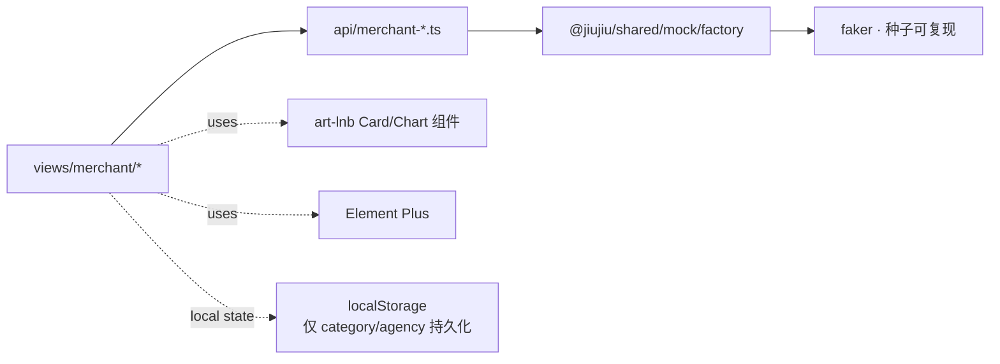

# DESIGN · S3 商家 PC 业务实施

> 6A 阶段 2：Architect。沿用 admin-pc 已有架构，仅做"内容层"设计。

---

## 1. 数据流



## 2. 共享 mock API 层

新增 `src/api/merchant-business.ts`：

```ts
import {
  genMerchantDashboard, genMerchantStats,
  genProducts, genMerchantCategories,
  genOrders, genRefund,
  genUsers
} from '@jiujiu/shared/mock/factory'

const delay = <T>(d: T, ms = 200) => new Promise<T>(r => setTimeout(() => r(d), ms))

export const merchantBizApi = {
  dashboard: () => delay({ stats: genMerchantDashboard(), trend: genMerchantStats('week') }),
  products: (params?) => delay(genProducts(50)),
  categories: () => delay(genMerchantCategories('m-001', 6)),
  orders: (params?) => delay(genOrders(60)),
  aftersale: () => delay(/* 20 单 */),
  customers: () => delay(genUsers(40, { role: 'customer' })),
}
```

## 3. 9 屏布局规范

### 通用结构

```
+---------------------------------------------------+
| PageHeader（h2 + 副标题 + 操作按钮组）             |
+---------------------------------------------------+
| 工具栏（Tab / Search / Filter / 批量操作）         |
+---------------------------------------------------+
| 主体（Table / Form / Card grid / Tree+Detail）    |
+---------------------------------------------------+
| 抽屉（详情 / 编辑）                                 |
+---------------------------------------------------+
```

### Dashboard 网格

```
┌────────┬────────┬────────┬────────┐  KPI 4 卡
├────────┴────────┴────┬───┴────────┤
│ 销售趋势折线 (2/3)    │ 类目占比环 │
├──────────────────────┼────────────┤
│ 商品销量条形         │ 待办 5 项  │
├──────────────────────┴────────────┤
│ 快捷入口 × 6                       │
└───────────────────────────────────┘
```

## 4. 关键组件

| 组件 | 职责 |
|---|---|
| `modules/KpiRow.vue` | 4 个 ArtStatsCard |
| `modules/TrendChart.vue` | ArtLineChartCard，从 `dashboard.trend.series` 取数 |
| `modules/TodoList.vue` | ArtTimelineListCard |
| `modules/QuickEntries.vue` | 6 个图标按钮 grid |
| `modules/ImageManager.vue` | 移动端 add.vue 图片 CRUD 桌面化 |
| `modules/SkuMatrix.vue` | 自定义规格 → 笛卡尔积 → ElTable 编辑 |
| `modules/OrderDetailDrawer.vue` | 订单详情含商品/物流/操作 |

## 5. 异常处理

| 场景 | 处理 |
|---|---|
| mock 工厂返回为空 | ElEmpty 占位 |
| 表单校验失败 | ElForm rules + 滚动到错误项 |
| 拖拽分类排序冲突 | 失败回滚 + ElMessage 提示 |
| 图片预览失败 | placeholder 兜底 |

## 6. 风险

| 风险 | 缓解 |
|---|---|
| ECharts 大数据点 | 趋势仅 7/30 天，渲染压力可忽略 |
| ElTable 列过多横向滚动 | 默认 fixed left/right + min-width |
| Drawer 嵌套（详情里再开 Drawer） | 不嵌套，订单详情用 inner card 而非二级 Drawer |
