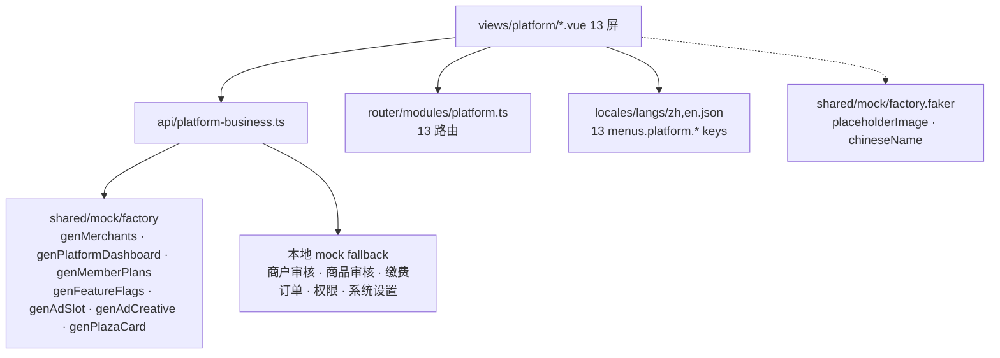

# DESIGN · S5 平台 PC 业务实施

> 6A 阶段 2 · 架构 / 模块 / 接口

## 1. 系统分层



## 2. 模块清单

### 2.1 API（`api/platform-business.ts`）

按屏分组 ≈ 30 个函数：

| 屏 | 函数 |
|---|---|
| dashboard | `fetchPlatformDashboard()` |
| merchant/list | `fetchPlatformMerchants(params)` · `pauseMerchant(id)` · `resumeMerchant(id)` |
| order/list | `fetchPlatformOrders(params)` |
| data-center | `fetchPlatformStats(period)` |
| audit/merchant | `fetchMerchantAudits(status)` · `approveMerchant(id)` · `rejectMerchant(id, reason)` |
| audit/product | `fetchProductAudits(status)` · `fetchProductAuditConfig()` · `saveProductAuditConfig(cfg)` · `approveProduct(id)` · `rejectProduct(id, reason)` |
| ad | `fetchAdSlots()` · `fetchAdCreatives(slotId?)` · `fetchAdStats()` |
| plaza | `fetchPlatformPlaza(type)` · `pushPlaza(payload)` |
| member/plan | `fetchPlatformMemberPlans()` · `savePlatformMemberPlan(p)` |
| member/orders | `fetchMemberPayOrders(status)` |
| permission | `fetchAdminRoles()` · `fetchAdminUsers()` · `saveAdminRole(r)` · `removeAdminRole(id)` · `saveAdminUser(u)` · `toggleAdminUser(id)` |
| system | `fetchSystemSettings()` · `saveSystemSettings(s)` |
| feature-flag | `fetchFeatureFlags()` · `toggleFeatureFlag(key)` · `saveGrayscale(cfg)` |

### 2.2 路由（新增 2 条）

```ts
{ path: 'merchant/list', name: 'PlatformMerchantList', component: '/platform/merchant/list',
  meta: { title: 'menus.platform.merchantList', icon: 'ri:store-2-line', keepAlive: true, roles: ['platform'] } },
{ path: 'order/list', name: 'PlatformOrderList', component: '/platform/order/list',
  meta: { title: 'menus.platform.orderList', icon: 'ri:bill-line', keepAlive: true, roles: ['platform'] } },
```

dashboard 路由调整 `keepAlive: false → false`（保持）；其余 11 屏路由不动。

### 2.3 i18n key

```json
"menus.platform.merchantList": "商户列表" / "Merchants",
"menus.platform.orderList": "平台订单" / "Orders"
```

其余 11 项已在 zh/en.json，无需改。

## 3. 接口契约（关键类型）

```ts
// dashboard
interface PlatformDashboardVM extends PlatformDashboard {}

// merchant list
interface PlatformMerchantsParams { tab?: 'all'|'factory'|'store'|'disabled'; keyword?: string }

// product audit
interface AuditProduct {
  id: string; name: string; image: string; category: string;
  merchant: string; price: number; submittedAt: string;
  status: 'pending'|'auto_approved'|'rejected'
}
interface ProductAuditConfig {
  autoApprove: boolean
  conditions: { key: string; label: string; enabled: boolean }[]
  samplingRate: number
}

// member pay orders
interface PayOrderItem {
  id: string; no: string; merchantName: string; planName: string;
  amount: number; status: 'paid'|'pending'|'refunding'|'refunded';
  paidAt: string | null; payMethod: 'wechat'|'alipay'|'balance'
}

// permission
interface AdminUser { id: string; nickname: string; username: string; role: string; avatar?: string; status: 'active'|'paused'; lastLoginAt?: string }
interface AdminRole { id: string; name: string; desc: string; permissions: string[] }

// system
interface SystemSettings {
  site: { name: string; logo: string; icp: string }
  payment: { wechat: boolean; alipay: boolean; balance: boolean }
  logistics: { providers: string[]; defaultFreight: number }
  service: { phone: string; email: string; workTime: string }
  security: { passwordPolicy: string; ipWhitelist: string[] }
  business: { registerLimit: number; commissionRate: number }
}
```

## 4. 异常处理

| 场景 | 策略 |
|---|---|
| mock 数据不足 | 单文件 fallback，写默认数组 |
| 类型与 shared 不一致 | 在 API 文件中自定义本地接口（如 PayOrderItem、AuditProduct） |
| 持久化 | localStorage 单 key：`pf_admin_state`（feature-flag 配置 + 系统设置编辑态） |
| 路由 keep-alive | 全部 true 除 dashboard 外（与 S3.5 一致） |

## 5. 设计原则

- **不引新依赖**：完全沿用现有 Element Plus + ArtSvgIcon 体系
- **不动 art-lnb 框架**：只新增/替换 view + 加 2 个 menu key
- **复用 S3.5 模板**：PageHeader + ElCard + ElDrawer + 主题橙
- **桌面化**：移动端 Tab 用 ElTabs，移动端 ActionSheet 改 ElDropdown/ElDialog，移动端 NavBar 改 PageHeader

## 6. 风险评估

| 风险 | 缓解 |
|---|---|
| ad 创意列表数据量大 | ElTable + ElPagination 单页 20 |
| feature-flag 23 项开关排版 | 三栏 grid + ElSwitch sm 尺寸 |
| audit/product 商品图清晰度 | placeholderImage 600x600 + ElImage previewSrcList |
| system 5 分组高 | ElCard + ElDivider，可滚动 |
