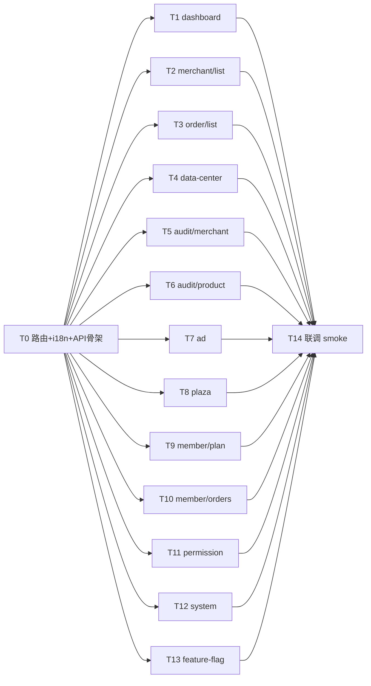

# TASK · S5 平台 PC 业务实施

> 6A 阶段 3 · 原子任务拆分

## 任务依赖图

## 任务列表

### T0 · 路由 + i18n + API 骨架

**输入**：DESIGN §2/§3
**输出**：
- `router/modules/platform.ts` +2 路由（merchant/list、order/list）
- `locales/langs/zh.json` & `en.json` +2 keys
- `api/platform-business.ts` ≈ 30 个 mock 函数（含 type 导出）

**AC**：vite 热更后路由可达，菜单显示 13 项。

---

### T1 · dashboard（数据驾驶舱）

**核心**：
- 顶部 4 KPI（商户 / 订单 / GMV / 用户 + 增量）
- 自绘 SVG 注册趋势曲线（最近 14 天）
- 待办栏 5 项（merchant / product / ad / complaint / withdraw）+ 红徽标
- 8 快捷入口（商户/商品/广告/会员/广场/开关/权限/系统）→ 路由跳转

**约束**：≈ 300 行；待办点击 → router.push 对应路由（withdraw 因 PC 无对应屏 → ElMessage.info）。

---

### T2 · merchant/list（商户列表）

**核心**：
- 4 Tab（全部/厂家/门店/已停用）+ 计数
- 顶部 4 统计卡（总数/厂家/门店/停用）
- ElTable：头像 + 名 + 类型 + 套餐 + 地区 + 累计 GMV + 信用 + 操作
- 操作：详情 Drawer / 设权限 ElDropdown / 停用 二次确认

**约束**：≈ 320 行；mock 数据 `genMerchants(40)`。

---

### T3 · order/list（平台订单）

**核心**：
- 6 Tab（全部/待付款/待发货/待收货/售后/已完成）
- 顶部 4 统计（总订单/今日 GMV/今日单数/投诉）
- ElTable：单号 + 收货人 + 金额 + 商品数 + 状态 + 支付时间
- 详情 Drawer：订单完整信息

**约束**：≈ 280 行；mock `Array.from({length:50}, () => genOrder())`。

---

### T4 · data-center（数据中心）

**核心**：
- 4 周期 RadioGroup（今日/本周/本月/本年）
- 顶部 4 大数据卡（与 dashboard 类似但更细）
- 注册趋势 SVG（最近 14 天）
- 类目销售柱状（自绘 SVG 横条）
- 会员套餐分布（自绘 SVG 环形）
- 导出按钮 → ElMessage.success

**约束**：≈ 280 行。

---

### T5 · audit/merchant（商户审核）

**核心**：
- 3 Tab（待审核/已通过/已驳回）+ 计数
- 卡列表：名 + 类型徽章 + 时间 + 联系人 + 地区 + 经营类目 + 资质图（最多 3 张）
- 详情 Drawer：完整资质大图 + 法人 + 信用代码
- 通过：二次确认（提示授予 A 级/B 级权限）
- 驳回：ElMessageBox.prompt 填写原因，驳回后卡显红色提示条

**约束**：≈ 330 行；mock `genMerchants(20)`。

---

### T6 · audit/product（商品审核）

**核心**：
- 顶部「自动通过」总开关卡（渐变背景 + ElSwitch）
- 免审条件列表（4 条 + ElCheckbox）+ 抽检比例（ElInputNumber 5/10/20/30/50%）
- 3 Tab（待审核/自动通过/已驳回）
- ElTable：商品图 + 名 + 商户 + 类目 + 价格 + 提交时间 + 状态徽章 + 操作
- 操作：详情 / 通过 / 驳回（ElDropdown 5 个驳回原因）/ 抽检

**约束**：≈ 360 行；mock 本地造 30 个 AuditProduct。

---

### T7 · ad（广告管理）

**核心**：
- 3 Tab（广告位/创意/数据）
- 顶部 4 统计（投放中 / 创意数 / 总曝光 / 平均 CTR）
- 广告位 Tab：卡列表（名 + 状态 + 投放对象 + 曝光/点击 + 预览图 + 编辑）
- 创意 Tab：ElTable（标题 + 图 + 状态 + 时段 + 预算/已花 + 曝光/点击）
- 数据 Tab：每位广告位的图表行（自绘）

**约束**：≈ 350 行；mock genAdSlot × 5 + genAdCreative × 20。

---

### T8 · plaza（平台选品广场）

**核心**：
- 3 Tab（推送商品 / 推送厂家 / 推送记录）
- 顶部 3 统计（在推 / 厂家数 / 总代理数）
- 搜索 + 批量勾选 + 批量推送按钮
- ElTable：勾 + 图 + 名 + 厂家 + 价 + 标签 + 状态 + 代理数 + 操作
- 推送 Drawer：投放对象（厂家+门店）+ 时段 + 权重 InputNumber + 备注

**约束**：≈ 380 行；mock genPlazaCard × 25。

---

### T9 · member/plan（会员套餐）

**核心**：
- 4 Tab（会员套餐 / 推广套餐 / 缴费订单跳转 / 增值包）
- 试用期配置（顶部条 + ElSelect 7/15/30/60/关闭）
- 套餐卡：名 + 价 + 权益 + 编辑按钮（ElDropdown 修改价/权益/限制/上下架）
- 推广套餐 Tab：同样卡 + 投放约束（slots / weightLimit / bannerLimit / impressionLimit）
- 增值包 Tab：4 项单价网格
- 新增按钮 → ElMessage.info

**约束**：≈ 360 行；mock `genMemberPlans()`。

---

### T10 · member/orders（缴费订单）

**核心**：
- 4 Tab（全部 / 已支付 / 待支付 / 退款中）
- 顶部 4 统计（总收入 / 总单数 / 待支付数 / 退款中数）
- ElTable：单号 + 商户 + 套餐 + 金额 + 支付方式徽标 + 状态徽标 + 支付时间 + 详情
- 详情 Drawer：完整信息

**约束**：≈ 240 行；mock 本地造 30 个 PayOrderItem。

---

### T11 · permission（权限管理）

**核心**：
- 2 Tab（角色 / 管理员）
- 角色 Tab：卡列表（名 + 描述 + 成员数 + 权限摘要 + 编辑/删除）
- 管理员 Tab：ElTable（头像 + 昵称 + 用户名 + 角色 + 状态 + 最近登录 + 操作）
- 操作：修改角色 / 重置密码（toast）/ 停用/恢复 / 删除
- 新增角色 Drawer（名 + 描述 + 权限 ElCheckboxGroup）
- 新增管理员 Drawer（昵称 + 用户名 + 角色 + 密码）

**约束**：≈ 380 行；mock 本地造 5 角色 + 8 管理员。

---

### T12 · system（系统设置）

**核心**：5 ElCard 分组：
1. 站点：平台名 / Logo URL / ICP / 注册商家上限 / 抽佣比例
2. 支付：微信 / 支付宝 / 余额 ElSwitch
3. 物流：默认运费 ElInputNumber + 物流商 ElCheckboxGroup（顺丰/京东/中通/圆通）
4. 客服：电话 / 邮箱 / 工作时间
5. 安全：密码策略 ElSelect + IP 白名单 ElInput 多行
- 保存按钮 → ElMessage.success + localStorage

**约束**：≈ 380 行。

---

### T13 · feature-flag（功能开关）

**核心**：
- 顶部受众 ElRadioGroup（全部/厂家/门店/指定）
- 灰度配置卡：百分比 ElInputNumber + 命中规则 ElRadioGroup（随机 / 白名单 / 等级）
- 三组开关：
  - 首页快捷入口（10 项，含「常开」「仅厂家」「HOT」徽标）
  - 商户角色入口按钮（5 项）
  - 侧边/二级菜单（8 项）
- 计数 / 总数显示
- 重置按钮 + 保存按钮
- 关联 mock genFeatureFlags()

**约束**：≈ 380 行。

---

### T14 · 联调 + smoke test

**输入**：T1-T13 完成
**输出**：
- vite dev server 无 error
- curl 13 个 URL 全 200（含 `/platform/merchant/list`、`/platform/order/list`）
- 手动核验 13 AC

## 总计估算

- 代码：13 屏 + 1 API + 1 路由 + 1 i18n ≈ **4200 行**
- 时间：T0 ≈ 30min；T1-T13 ≈ 每屏 8-12min；T14 ≈ 10min；总 **≈ 2.5-3h**
- 不写测试，不接真后端
