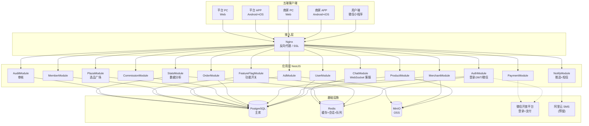
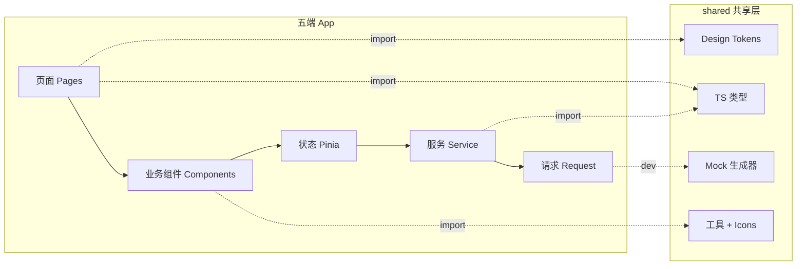
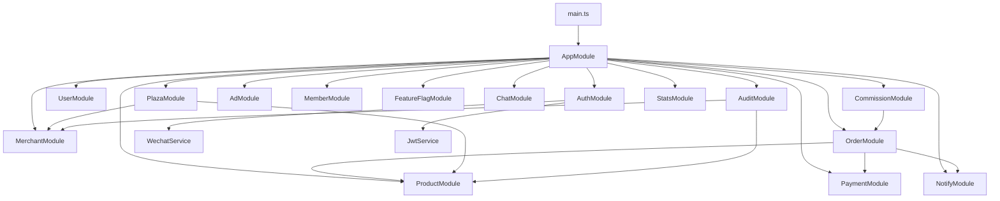
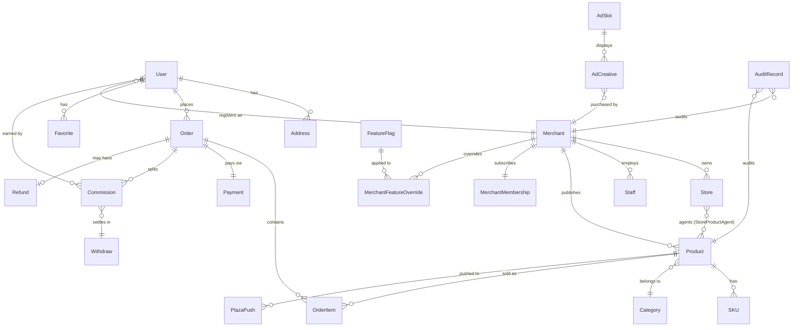
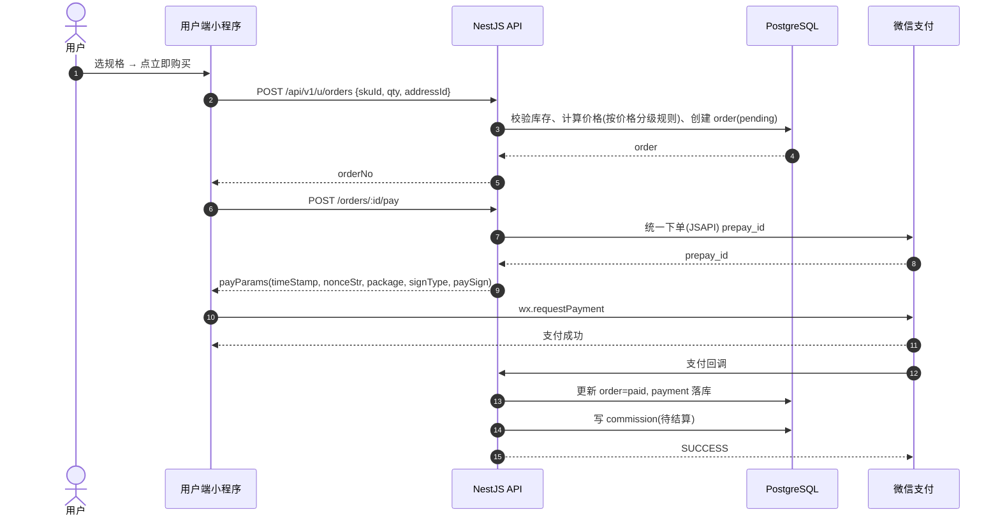
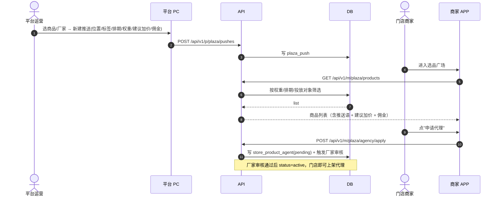
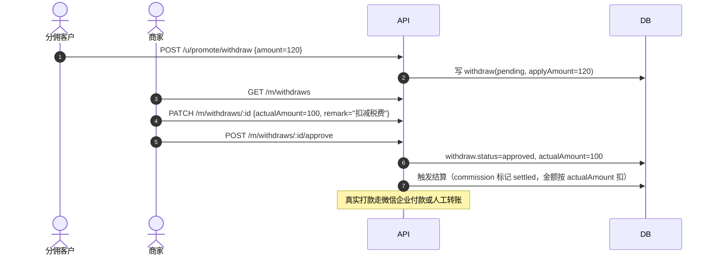
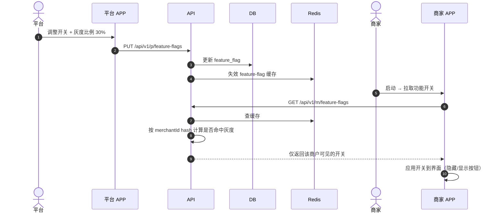
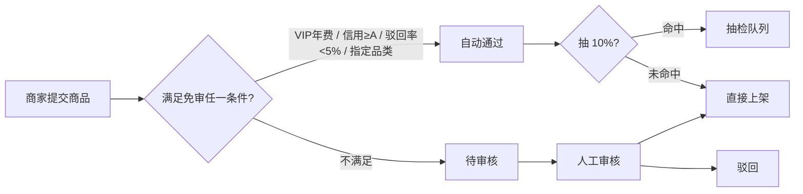

# DESIGN · 经纬科技 5.0 架构设计

> 阶段：6A · 第 2 阶段 Architect
> 状态：✅ 已定稿
> 上游：`CONSENSUS_商城5.0还原.md`

---

## 目录

1. [整体架构图](#1-整体架构图)
2. [前端架构](#2-前端架构)
3. [后端架构](#3-后端架构)
4. [数据库设计](#4-数据库设计)
5. [接口契约（API 设计）](#5-接口契约api-设计)
6. [核心数据流](#6-核心数据流)
7. [认证与权限](#7-认证与权限)
8. [设计系统 / Design Tokens](#8-设计系统--design-tokens)
9. [Mock 体系设计](#9-mock-体系设计)
10. [部署架构](#10-部署架构)
11. [异常处理与日志](#11-异常处理与日志)
12. [非功能性需求](#12-非功能性需求)

---

## 1. 整体架构图



---

## 2. 前端架构

### 2.1 分层



### 2.2 共享层（packages/shared）目录

```
shared/
├── src/
│   ├── tokens/
│   │   ├── colors.ts        # 色板
│   │   ├── spacing.ts       # 8px 基线
│   │   ├── typography.ts    # 字号/行高/字重
│   │   ├── shadow.ts
│   │   ├── radius.ts
│   │   └── index.ts
│   ├── types/
│   │   ├── auth.ts          # LoginDto / UserSession
│   │   ├── merchant.ts      # Merchant / Store / Staff
│   │   ├── product.ts       # Product / SKU / Category
│   │   ├── order.ts         # Order / OrderItem / OrderStatus
│   │   ├── commission.ts    # CommissionRule / Withdraw
│   │   ├── plaza.ts         # PlazaPush / FactoryAgent
│   │   ├── ad.ts            # AdSlot / AdCreative
│   │   ├── member.ts        # MemberPlan / AdPlan
│   │   ├── feature-flag.ts
│   │   ├── common.ts        # PaginationDto / ApiResult
│   │   └── index.ts
│   ├── mock/
│   │   ├── factory/         # mock 生成器（faker.js）
│   │   ├── data/            # 静态种子数据
│   │   ├── interceptor.ts   # 路由拦截器（uni-app 用）
│   │   ├── vite-plugin.ts   # vite-plugin-mock 配置
│   │   └── index.ts
│   ├── utils/
│   │   ├── format.ts        # 货币/日期/数字格式化
│   │   ├── validate.ts      # 校验
│   │   ├── encrypt.ts
│   │   ├── storage.ts       # 跨端 storage 适配
│   │   └── index.ts
│   └── icons/
│       └── *.svg
└── package.json
```

### 2.3 uni-app 端通用结构

```
merchant-app/        # 同样适用 user-mp / platform-app
├── src/
│   ├── pages/                 # 页面
│   │   ├── tabbar/
│   │   │   ├── home/
│   │   │   ├── product/
│   │   │   ├── order/
│   │   │   ├── stats/
│   │   │   └── me/
│   │   ├── product/
│   │   │   ├── add.vue
│   │   │   ├── edit.vue
│   │   │   ├── category.vue
│   │   │   └── extension.vue  # 产品扩展
│   │   ├── order/
│   │   │   ├── detail.vue
│   │   │   └── aftersale.vue
│   │   ├── customer/
│   │   ├── commission/
│   │   ├── withdraw/
│   │   ├── store/
│   │   ├── staff/
│   │   ├── shop-decorate/
│   │   ├── marketing/
│   │   ├── chat/
│   │   ├── plaza/
│   │   │   ├── index.vue
│   │   │   └── factory.vue
│   │   └── member/
│   ├── components/            # 业务组件
│   │   ├── product-card/
│   │   ├── order-card/
│   │   ├── price-tier/        # 价格分级显示组件
│   │   ├── status-tag/
│   │   ├── nav-bar/
│   │   └── tab-bar/
│   ├── store/                 # Pinia
│   │   ├── user.ts
│   │   ├── product.ts
│   │   ├── order.ts
│   │   ├── feature-flag.ts    # 功能开关
│   │   └── index.ts
│   ├── service/               # 业务服务
│   │   ├── auth.ts
│   │   ├── product.ts
│   │   ├── order.ts
│   │   └── ...
│   ├── utils/
│   │   ├── request.ts         # 含 mock 拦截器
│   │   ├── auth.ts
│   │   └── ...
│   ├── styles/
│   │   ├── tokens.scss        # 从 shared/tokens 生成
│   │   ├── reset.scss
│   │   └── common.scss
│   ├── App.vue
│   ├── main.ts
│   ├── pages.json
│   ├── manifest.json
│   └── uni.scss
├── vite.config.ts
└── package.json
```

### 2.4 PC 端结构（merchant-pc / platform-pc）

```
merchant-pc/
├── src/
│   ├── views/                 # 页面
│   ├── components/
│   ├── layouts/
│   │   └── AdminLayout.vue    # 含侧边栏 + 顶栏
│   ├── router/
│   ├── store/
│   ├── service/
│   ├── utils/
│   ├── styles/
│   ├── App.vue
│   └── main.ts
├── mock/                      # vite-plugin-mock 入口
├── vite.config.ts
└── package.json
```

---

## 3. 后端架构

### 3.1 NestJS 模块图



### 3.2 模块职责

| 模块 | 职责 |
|------|------|
| AuthModule | 微信小程序 code2session、JWT 签发/校验、刷新 token、登出 |
| UserModule | 普通客户 / 分佣客户管理、地址簿、收藏 |
| MerchantModule | 商家入驻、商户信息、门店、员工、店铺装修配置 |
| ProductModule | 商品 CRUD、规格 SKU、分类（平台+商家自定义）、价格分级显示规则 |
| OrderModule | 下单、订单列表、订单详情、状态机、地址识别、售后 |
| PaymentModule | 微信支付下单 / 回调 / 退款、余额 |
| CommissionModule | 佣金规则、佣金明细、提现申请 / 审核（含金额微调 + 备注） |
| PlazaModule | 选品广场推送、代理申请、厂家详情、推送位 |
| AdModule | 广告位、广告创意、投放排期、数据统计 |
| MemberModule | 会员套餐（基础包）+ 广告推送套餐 + 缴费订单 + 会员状态 |
| FeatureFlagModule | 商家端功能开关（首页入口 / 角色按钮 / 侧边菜单）+ 灰度发布 |
| NotifyModule | 微信订阅消息、APP 推送、短信（预留） |
| ChatModule | 在线客服 WebSocket / 快捷回复 / 历史 |
| AuditModule | 商户入驻审核、商品审核（含自动免审规则） |
| StatsModule | 仪表盘聚合、热销 TOP、品类分布、地区分布、功能使用分析 |

### 3.3 通用基础设施（common/）

```
common/
├── guards/
│   ├── jwt-auth.guard.ts
│   ├── role.guard.ts          # 角色守卫
│   └── permission.guard.ts    # 细粒度权限守卫
├── decorators/
│   ├── current-user.ts
│   ├── roles.ts
│   └── public.ts              # 跳过认证
├── filters/
│   └── global-exception.filter.ts
├── interceptors/
│   ├── response.interceptor.ts # 统一响应格式
│   ├── logging.interceptor.ts
│   └── timeout.interceptor.ts
├── pipes/
│   └── validation.pipe.ts
├── middlewares/
│   └── trace-id.middleware.ts
└── dto/
    ├── pagination.dto.ts
    └── api-result.dto.ts
```

### 3.4 统一响应格式

```ts
interface ApiResult<T = unknown> {
  code: number;        // 0=成功，其他=业务错误码
  data: T | null;
  message: string;
  traceId: string;
}

interface Pagination<T> {
  list: T[];
  total: number;
  page: number;
  pageSize: number;
}
```

---

## 4. 数据库设计

### 4.1 核心实体 ER（精简版）



### 4.2 主要表清单（Prisma schema 片段，正式见 server/prisma/schema.prisma）

| 表 | 主要字段 |
|----|----------|
| `user` | id, openid, unionid, phone, nickname, avatar, role, status, createdAt |
| `address` | id, userId, name, phone, region, detail, isDefault |
| `merchant` | id, userId, type(factory/store), name, license, contact, qualifications[], status(pending/active/disabled), level, createdAt |
| `merchant_membership` | id, merchantId, plan(trial/monthly/yearly), startAt, endAt, status |
| `merchant_ad_plan` | id, merchantId, plan(basic/pro/flagship), startAt, endAt |
| `store` | id, merchantId, name, location, contact, level, status |
| `staff` | id, merchantId, name, role, phone, status, performance |
| `category` | id, parentId, name, sort, type(platform/merchant), merchantId? |
| `product` | id, merchantId, categoryId, name, images[], description, status(draft/auditing/active/offline), priceWholesale, priceRetail, priceMember, createdAt |
| `sku` | id, productId, specs(json), priceWholesale, priceRetail, priceMember, stock |
| `store_product_agent` | id, storeId, productId, markup(%), status, createdAt |
| `favorite` | id, userId, productId, createdAt |
| `cart_item` | id, userId, skuId, quantity |
| `order` | id, no, userId, merchantId, status, totalAmount, payAmount, discount, address(json), remark, createdAt |
| `order_item` | id, orderId, skuId, quantity, price |
| `payment` | id, orderId, method(wechat/balance), wxTransactionId, amount, status, paidAt |
| `refund` | id, orderId, reason, evidence[], status, refundAmount, createdAt |
| `commission_rule` | id, merchantId, productId?, level1(%), level2(%), scope |
| `commission` | id, orderId, userId, amount, status(pending/settled/cancelled), createdAt |
| `withdraw` | id, userId, applyAmount, actualAmount, remark, status, reviewedBy, reviewedAt |
| `plaza_push` | id, productId?, factoryId?, position[], tags[], scheduledStart, scheduledEnd, weight, suggestMarkup, suggestCommission, pushText, status |
| `ad_slot` | id, name, target(c/factory/store), position, status |
| `ad_creative` | id, slotId, merchantId?, image, link, startAt, endAt, impressions, clicks, budget |
| `member_plan` | id, type(basic/ad), code, name, price, period, rights(json), status |
| `pay_order` | id, merchantId, planId, amount, status(paid/refunding/refunded), createdAt |
| `feature_flag` | id, key, label, group(home/role/menu), defaultEnabled, targetRole(all/factory/store/specific), grayPercent, grayList[], scheduledAt |
| `merchant_feature_override` | id, merchantId, flagKey, enabled |
| `audit_record` | id, type(merchant/product), targetId, status, auditorId, reason, autoApproved, createdAt |
| `chat_session` | id, userId, merchantId, lastMessageAt |
| `chat_message` | id, sessionId, sender(user/merchant), content, type(text/image/quick), createdAt |
| `notification` | id, userId/merchantId, type, title, content, read, createdAt |
| `system_config` | key, value, description |
| `role` | id, code, name, permissions(json) |
| `admin_user` | id, username, password, roleId, status |

### 4.3 索引策略
- 所有外键加 index
- `order.no` unique
- `merchant.userId` unique（一个用户最多升级一个商家身份）
- `feature_flag.key` unique
- `product` 按 (merchantId, status) 复合索引
- `order` 按 (userId, status, createdAt desc) 复合索引

---

## 5. 接口契约（API 设计）

### 5.1 路由规范
- 前缀：`/api/v1`
- 资源化：`/products`, `/orders`, `/merchants` 等
- 子资源：`/merchants/:id/stores`
- 动作型：`POST /orders/:id/ship`, `POST /withdraws/:id/approve`
- 端隔离：用户端 `/api/v1/u/*`、商家端 `/api/v1/m/*`、平台端 `/api/v1/p/*`（共用资源用同一路径，权限守卫区分）

### 5.2 关键端点清单（精简版，正式见 Swagger）

#### 认证
| Method | Path | 说明 |
|--------|------|------|
| POST | `/api/v1/auth/wechat-login` | 微信小程序登录（code → openid → JWT） |
| POST | `/api/v1/auth/refresh` | 刷新 token |
| POST | `/api/v1/auth/logout` | 登出 |
| POST | `/api/v1/auth/admin-login` | 平台管理员登录（账号密码） |

#### 用户端
| GET | `/api/v1/u/home` | 首页聚合（banner + 推荐瀑布流） |
| GET | `/api/v1/u/products` | 商品列表（分类/搜索/分页） |
| GET | `/api/v1/u/products/:id` | 商品详情 |
| GET | `/api/v1/u/categories` | 一二级分类 |
| GET/POST/DELETE | `/api/v1/u/cart` | 购物车 |
| GET/POST/DELETE | `/api/v1/u/favorites` | 收藏 |
| POST | `/api/v1/u/orders` | 下单 |
| GET | `/api/v1/u/orders` | 我的订单 |
| GET | `/api/v1/u/orders/:id` | 订单详情 |
| POST | `/api/v1/u/orders/:id/pay` | 唤起支付 |
| POST | `/api/v1/u/orders/:id/confirm` | 确认收货 |
| POST | `/api/v1/u/orders/:id/refund` | 申请退款 |
| GET/POST | `/api/v1/u/addresses` | 地址簿 |
| POST | `/api/v1/u/bookings` | 预约量尺 |
| GET | `/api/v1/u/promote/summary` | 推广分佣概览 |
| GET | `/api/v1/u/promote/orders` | 佣金明细 |
| POST | `/api/v1/u/promote/withdraw` | 申请提现 |
| GET | `/api/v1/u/stores/nearby` | 附近门店 |
| POST | `/api/v1/u/merchants/apply` | 商家入驻申请 |

#### 商家端（厂家 + 门店）
| GET | `/api/v1/m/dashboard` | 首页数据 + 待办 |
| GET | `/api/v1/m/stats` | 数据统计 |
| GET/POST | `/api/v1/m/products` | 商品 |
| PUT/DELETE | `/api/v1/m/products/:id` | 商品 |
| POST | `/api/v1/m/products/:id/online` | 上架 |
| POST | `/api/v1/m/products/:id/offline` | 下架 |
| GET/POST | `/api/v1/m/categories` | 分类（商家自定义） |
| GET | `/api/v1/m/orders` | 订单 |
| POST | `/api/v1/m/orders/:id/ship` | 发货 |
| POST | `/api/v1/m/orders/:id/parse-address` | 一键识别地址 |
| GET | `/api/v1/m/refunds` | 售后列表 |
| POST | `/api/v1/m/refunds/:id/approve` | 同意退款 |
| POST | `/api/v1/m/refunds/:id/reject` | 拒绝 |
| GET/POST | `/api/v1/m/customers` | 客户 |
| PUT | `/api/v1/m/customers/:id/price-tier` | 客户价格权限 |
| GET/POST | `/api/v1/m/commission/rules` | 佣金规则 |
| GET | `/api/v1/m/withdraws` | 提现申请列表 |
| POST | `/api/v1/m/withdraws/:id/approve` | 通过（含金额调整 + 备注） |
| POST | `/api/v1/m/withdraws/:id/reject` | 驳回 |
| GET/POST | `/api/v1/m/stores` | 门店 |
| PUT | `/api/v1/m/stores/:id/auth` | 门店授权配置 |
| GET/POST/PUT | `/api/v1/m/staffs` | 员工 |
| GET/PUT | `/api/v1/m/shop-decorate` | 店铺装修 |
| GET/POST | `/api/v1/m/marketing/coupons` | 优惠券 |
| GET/POST | `/api/v1/m/marketing/groupbuys` | 团购 |
| GET/POST | `/api/v1/m/marketing/flashsales` | 限时购 |
| WS | `/api/v1/m/chat` | 在线客服 |
| GET | `/api/v1/m/plaza/products` | 选品广场商品 |
| GET | `/api/v1/m/plaza/factories` | 选品广场厂家 |
| GET | `/api/v1/m/plaza/factories/:id` | 厂家详情 |
| POST | `/api/v1/m/plaza/agency/apply` | 申请代理 |
| GET/POST | `/api/v1/m/membership` | 会员套餐查询/订购 |
| GET | `/api/v1/m/feature-flags` | 商家端可见功能开关（已经计算过灰度） |

#### 平台端
| GET | `/api/v1/p/dashboard` | 仪表盘 |
| GET | `/api/v1/p/audit/merchants` | 入驻审核列表 |
| POST | `/api/v1/p/audit/merchants/:id/approve` | 通过 |
| POST | `/api/v1/p/audit/merchants/:id/reject` | 驳回 |
| GET | `/api/v1/p/audit/products` | 商品审核 |
| POST | `/api/v1/p/audit/products/:id/approve` | 通过 |
| POST | `/api/v1/p/audit/products/:id/sample-check` | 抽检 |
| GET/PUT | `/api/v1/p/audit/auto-approve` | 自动免审规则 |
| GET/POST | `/api/v1/p/merchants` | 商户列表 |
| POST | `/api/v1/p/merchants/:id/disable` | 停用 |
| GET/POST | `/api/v1/p/ads` | 广告位/创意 |
| GET/POST/PUT/DELETE | `/api/v1/p/plaza/pushes` | 选品广场推送 |
| GET/POST | `/api/v1/p/member-plans` | 会员套餐管理 |
| GET/POST | `/api/v1/p/ad-plans` | 广告推送套餐管理 |
| GET | `/api/v1/p/pay-orders` | 缴费订单 |
| GET/PUT | `/api/v1/p/feature-flags` | 功能开关（含灰度） |
| GET/POST | `/api/v1/p/roles` | 角色管理 |
| GET/POST/PUT | `/api/v1/p/admins` | 管理员 |
| GET/PUT | `/api/v1/p/system-config` | 系统配置 |
| GET | `/api/v1/p/analytics/features` | 功能使用分析 |
| GET | `/api/v1/p/analytics/merchants` | 商户增长 |
| GET | `/api/v1/p/analytics/transactions` | 交易分析 |

### 5.3 错误码（节选）
| Code | 说明 |
|------|------|
| 0 | 成功 |
| 1000 | 通用业务错误 |
| 1001 | 参数校验失败 |
| 1002 | 资源不存在 |
| 1003 | 操作冲突 |
| 2001 | 未登录 |
| 2002 | token 过期 |
| 2003 | 权限不足 |
| 3001 | 商品已下架 |
| 3002 | 库存不足 |
| 4001 | 订单状态不允许此操作 |
| 5001 | 支付失败 |
| 6001 | 会员套餐已过期 |

---

## 6. 核心数据流

### 6.1 用户下单 + 微信支付



### 6.2 选品广场推送 → 代理



### 6.3 提现申请 + 调整金额审核



### 6.4 平台下发功能开关（含灰度）



### 6.5 商品自动免审



---

## 7. 认证与权限

### 7.1 三套登录体系
- **C 端用户**：微信小程序 `wx.login` → `code2session` → `openid` → 后端签发 JWT
- **商家**：登录用户绑定商家身份后，token 中加 `merchantId` + `merchantType`
- **平台管理员**：账号密码登录（含 2FA 可选）

### 7.2 JWT 结构
```json
{
  "sub": "user_id",
  "openid": "...",
  "role": "customer|factory|store|admin",
  "merchantId": "...",
  "permissions": ["product:read", "order:write", ...],
  "iat": 1700000000,
  "exp": 1700604800
}
```

### 7.3 权限分层
1. **角色（Role）**：customer / factory / store / admin / operator / auditor / cs / finance
2. **资源 + 操作（Permission）**：`{resource}:{action}`，如 `product:audit` `withdraw:approve`
3. **数据范围（Scope）**：商家只能看自己的数据；门店只能看自己代理的商品

### 7.4 Guards 调用链
```
RouteHandler
  ↓ JwtAuthGuard            （是否已登录）
  ↓ RoleGuard               （角色是否匹配）
  ↓ PermissionGuard         （细粒度权限）
  ↓ DataScopeInterceptor    （自动注入 where 条件）
  ↓ BusinessLogic
```

---

## 8. 设计系统 / Design Tokens

### 8.1 色板（packages/shared/src/tokens/colors.ts）

```ts
export const colors = {
  brand: {
    primary: '#FF4D2D',
    primaryHover: '#FF6E4D',
    primaryActive: '#E63D1F',
    secondary: '#FFB84D',
    gradient: 'linear-gradient(135deg, #FF6E4D, #FF4D2D)',
  },
  text: {
    primary: '#1A1A2E',
    secondary: '#4E5969',
    tertiary: '#86909C',
    disabled: '#C9CDD4',
    inverse: '#FFFFFF',
  },
  bg: {
    page: '#F7F8FA',
    card: '#FFFFFF',
    hover: '#F2F3F5',
    mask: 'rgba(0,0,0,0.55)',
  },
  border: {
    default: '#E5E6EB',
    light: '#F2F3F5',
    dark: '#C9CDD4',
  },
  status: {
    success: '#00B42A',
    warning: '#FF7D00',
    error: '#F53F3F',
    info: '#165DFF',
    highlight: '#FFD43B',
  },
  // 业务色
  business: {
    wholesale: '#1677FF',  // 批发价标签
    retail: '#FF4D2D',     // 零售价
    member: '#722ED1',     // 会员价
    commission: '#00B42A', // 佣金
  },
} as const;
```

### 8.2 间距 / 字号 / 圆角

| Token | 值 | 用途 |
|-------|----|----|
| spacing-2 | 4px | xs |
| spacing-4 | 8px | sm |
| spacing-6 | 12px | md（基线） |
| spacing-8 | 16px | lg |
| spacing-12 | 24px | xl |
| font-xs | 10/12px | 辅助 |
| font-sm | 12/14px | 正文小 |
| font-base | 14/16px | 正文 |
| font-lg | 16/18px | 强调 |
| font-xl | 20/22px | 小标题 |
| font-2xl | 24/28px | 大标题 |
| radius-sm | 4px | tag |
| radius-md | 8px | card |
| radius-lg | 12px | modal |
| radius-pill | 999px | btn |

### 8.3 通用组件清单（packages/shared 提供"约定"，各端实现）
- PriceTier：价格分级展示（未登录/批发/零售/会员）
- StatusTag：订单状态、审核状态、会员状态
- EmptyState：空态
- ErrorBoundary：错误兜底
- AddressInput：地址识别+表单
- ImageUploader：图片上传组件（多端实现，同一 API）
- SwitchControl：开关
- PriceInput：价格输入（自动 ¥ 前缀 + 小数）

---

## 9. Mock 体系设计

### 9.1 数据模型一致性
- `shared/types/*` 同时被前端、后端、mock 引用
- Mock 数据生成器 `shared/mock/factory/*` 用 faker.js 生成符合 type 的数据

### 9.2 切换机制

**uni-app 端**：
```ts
// utils/request.ts
import { mockInterceptor } from '@shared/mock'

export const request = async (config) => {
  if (import.meta.env.VITE_USE_MOCK === 'true') {
    return mockInterceptor(config)
  }
  return uni.request(config)
}
```

**PC 端**：
```ts
// vite.config.ts
import { viteMockServe } from 'vite-plugin-mock'
import { mockConfig } from '@shared/mock/vite-plugin'

export default defineConfig({
  plugins: [
    vue(),
    viteMockServe(mockConfig),
  ],
})
```

### 9.3 持久化
- mock 模式下 CRUD 写入 IndexedDB（PC）/ uni.setStorage（mobile），实现"看起来真"的效果
- 切换 mock/真实时可一键清理 IndexedDB

---

## 10. 部署架构

### 10.1 Docker Compose 服务

```yaml
# deploy/docker-compose.yml（核心）
services:
  postgres:
    image: postgres:16-alpine
  redis:
    image: redis:7-alpine
  minio:
    image: minio/minio
  server:
    build: ../packages/server
    depends_on: [postgres, redis, minio]
  nginx:
    image: nginx:alpine
    depends_on: [server]
```

### 10.2 环境变量分层
```
.env.example       # 模板
.env               # 本地开发（gitignore）
.env.production    # 生产
```

### 10.3 CI/CD（GitHub Actions 或 GitLab CI）
1. push → lint + typecheck + unit test
2. PR → build 各端 + e2e
3. merge main → docker build & push
4. 手动触发 → 部署生产

---

## 11. 异常处理与日志

### 11.1 异常体系
```ts
// 业务异常基类
class BusinessException extends Error {
  constructor(public code: number, message: string, public data?: any) {}
}

// 全局异常过滤器
// 输出统一格式 { code, data, message, traceId }
```

### 11.2 错误降级
- 前端：API 报错 → 兜底空数据 + Toast 提示
- 后端：依赖服务（微信支付、OSS）超时 → 重试 + 队列补偿

### 11.3 日志规范
- 接入层：access log（Nginx）
- 应用层：pino（结构化）+ traceId 贯穿
- 持久化：本地 file → 生产可对接 SLS / Loki

### 11.4 告警
- Sentry 接前端 + 后端
- 关键指标（错误率 / 响应时间 / 待审核积压）超阈值告警

---

## 12. 非功能性需求

| 指标 | 目标 |
|------|------|
| 接口 P95 响应 | ≤ 500ms |
| 接口 P99 响应 | ≤ 1.5s |
| 小程序冷启动 | ≤ 2s |
| PC 首屏 | ≤ 1.5s |
| 单元测试覆盖率 | 核心服务 ≥ 60% |
| 可用性 | 99.5% |
| 数据安全 | 密码 bcrypt、敏感字段加密、HTTPS only |
| 限流 | 单 IP 60req/min，登录 5req/min |
| 备份 | 数据库每日全量 + 增量 binlog |

---

**文档版本**：v1.0
**作者**：Claude
**下一步**：进入 Atomize 阶段，写 `TASK_商城5.0还原.md`
