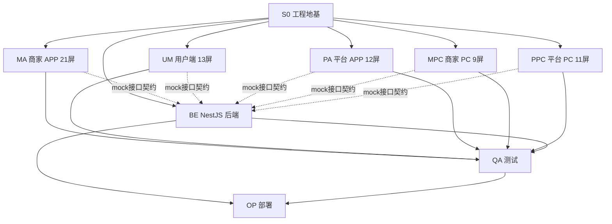
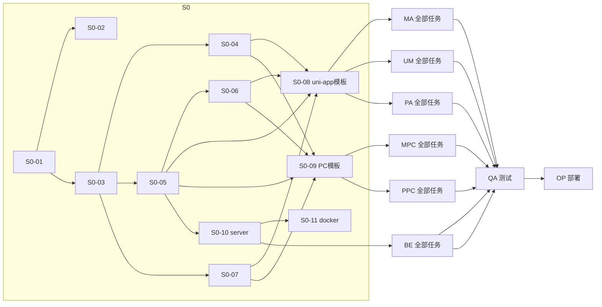

# TASK · 经纬科技 5.0 原子任务拆分

> 阶段：6A · 第 3 阶段 Atomize
> 上游：`DESIGN_商城5.0还原.md`
> 状态：✅ 定稿（待 Approve 阶段审批）

---

## 任务编码规范
- **代号前缀**：`S0`（地基）/ `MA`（商家 APP）/ `UM`（用户端小程序）/ `PA`（平台 APP）/ `MPC`（商家 PC）/ `PPC`（平台 PC）/ `BE`（后端）/ `OP`（运维 / 部署）/ `QA`（测试）
- **粒度**：每个原子任务 0.5 ~ 2 个工作日内可完成

---

## 总依赖图（高层）

---

## S0 · 工程地基（11 个原子任务）

| ID | 任务 | 输入契约 | 输出契约 | 验收 |
|----|------|----------|----------|------|
| S0-01 | 初始化 pnpm monorepo | 项目根目录 | `pnpm-workspace.yaml`、根 `package.json`、`.gitignore`、`.editorconfig`、`.prettierrc`、`tsconfig.base.json` | `pnpm install` 成功 |
| S0-02 | 配置 lint / format / git hooks | S0-01 | eslint + prettier + husky + lint-staged + commitlint | `pnpm lint` 通过 |
| S0-03 | 搭建 `packages/shared` 骨架 | S0-01 | tokens / types / utils / icons / mock 子目录、`package.json`、`tsup` 构建 | `pnpm build:shared` 出 dist |
| S0-04 | Design Tokens 实现 | DESIGN §8 | `shared/tokens/{colors,spacing,typography,shadow,radius}.ts` + 生成 scss 变量 | 任一端 import 后样式生效 |
| S0-05 | TS 类型契约 | DESIGN §4-5 | `shared/types/*.ts`（auth/merchant/product/order/...） | 前后端 import 同源类型 |
| S0-06 | Mock 数据生成器框架 | S0-05 | `shared/mock/factory/*`（faker.js） + `interceptor.ts` + `vite-plugin.ts` | `generateProducts(20)` 可用 |
| S0-07 | 业务图标 SVG sprite | DESIGN §8 | `shared/icons/*.svg` + 索引 | 各端可 `<icon name="cart" />` |
| S0-08 | uni-app 模板（merchant-app/user-mp/platform-app 共 3 个） | S0-03 | 三个 packages 初始化 + uview-plus + pinia + vite + 微信小程序配置 | `pnpm dev:merchant-app` 启动 H5 预览 |
| S0-09 | PC 模板（merchant-pc/platform-pc 共 2 个） | S0-03 | 两个 packages 初始化 + Vue3 + Vite + Arco Design Vue + Pinia + vue-router + vite-plugin-mock | `pnpm dev:merchant-pc` 启动 |
| S0-10 | `packages/server` NestJS 初始化 | S0-05 | nest new + prisma init + swagger + 通用模块（guards/filters/interceptors） | `pnpm dev:server` 起 3000 端口 + Swagger 可见 |
| S0-11 | Docker Compose（postgres+redis+minio+server） | S0-10 | `deploy/docker-compose.yml` + `.env.example` + Dockerfile | `docker compose up -d` 通 |

---

## BE · NestJS 后端（按模块拆分，35 个原子任务）

### BE-A · 数据库 & 通用基建（5）
| ID | 任务 |
|----|------|
| BE-A1 | Prisma schema：用户/地址/收藏/购物车 |
| BE-A2 | Prisma schema：商家/会员/广告套餐/门店/员工/分类 |
| BE-A3 | Prisma schema：商品/SKU/代理关系 |
| BE-A4 | Prisma schema：订单/订单项/支付/退款/佣金/提现 |
| BE-A5 | Prisma schema：选品广场推送/广告位/创意/审核/功能开关/角色权限/系统配置 + seed 数据 |

### BE-B · Auth & User（3）
| BE-B1 | AuthModule：微信小程序登录、JWT、刷新、登出 |
| BE-B2 | AuthModule：平台管理员账密登录 |
| BE-B3 | UserModule：用户信息、地址簿、收藏、购物车 |

### BE-C · Merchant（4）
| BE-C1 | MerchantModule：入驻申请、商户信息 CRUD |
| BE-C2 | MerchantModule：门店 + 员工 + 授权设置 |
| BE-C3 | MerchantModule：店铺装修配置 |
| BE-C4 | MerchantModule：商家自定义分类 |

### BE-D · Product（3）
| BE-D1 | ProductModule：商品 CRUD + SKU + 价格分级 |
| BE-D2 | ProductModule：上下架、批量操作、库存 |
| BE-D3 | ProductModule：产品扩展（代理申请） |

### BE-E · Order & Payment（4）
| BE-E1 | OrderModule：下单、库存扣减、价格分级计算 |
| BE-E2 | OrderModule：订单查询、详情、发货、确认收货、催发货 |
| BE-E3 | OrderModule：售后申请、审核、退款 + 一键地址识别 |
| BE-E4 | PaymentModule：微信支付下单、回调、退款 + 余额支付 |

### BE-F · Commission & Withdraw（2）
| BE-F1 | CommissionModule：佣金规则、佣金触发计算 |
| BE-F2 | WithdrawModule：申请、调整金额、备注、审核 |

### BE-G · Plaza & Ad（3）
| BE-G1 | PlazaModule：推送 CRUD、列表筛选、新建表单 |
| BE-G2 | PlazaModule：代理申请、厂家详情 |
| BE-G3 | AdModule：广告位 + 创意 + 排期 + 数据 |

### BE-H · Member & Pay Order（2）
| BE-H1 | MemberModule：会员套餐 / 广告推送套餐 / 增值单项 |
| BE-H2 | MemberModule：缴费订单 + 会员状态 + 续费 |

### BE-I · FeatureFlag（2）
| BE-I1 | FeatureFlagModule：开关 CRUD + 灰度算法 + Redis 缓存 |
| BE-I2 | FeatureFlagModule：商家端拉取接口（已过滤灰度） |

### BE-J · Audit（2）
| BE-J1 | AuditModule：商户入驻审核 |
| BE-J2 | AuditModule：商品审核 + 自动免审规则 + 10% 抽检 |

### BE-K · Chat & Notify & Stats（4）
| BE-K1 | ChatModule：WebSocket 客服 + 历史消息 + 快捷回复 |
| BE-K2 | NotifyModule：微信订阅消息 + APP 推送 + 短信预留 |
| BE-K3 | StatsModule：仪表盘聚合（商家） |
| BE-K4 | StatsModule：仪表盘聚合（平台）+ 数据分析 |

### BE-L · System & Permission（2）
| BE-L1 | RoleModule + AdminModule：角色权限、管理员 |
| BE-L2 | SystemConfigModule：基础设置 / 系统配置 |

---

## MA · 商家 APP 21 屏（24 个原子任务，含 3 个共享组件）

### MA-0 共享业务组件（3）
| ID | 任务 |
|----|------|
| MA-0a | NavBar + StatusBar + TabBar |
| MA-0b | ProductCard / OrderCard / EmptyState / PriceTier |
| MA-0c | request 拦截器（含 mock 切换） + Pinia store 骨架 |

### MA · 21 屏页面任务（依赖：MA-0a/b/c）

| ID | 屏 | 关键交互 | 依赖 BE |
|----|----|---------|---------|
| MA-01 | 商家首页（含选品广场入口） | 数据卡 + 快捷入口 + 选品广场卡 + 销售柱状图 + 待办 | BE-K3 |
| MA-02 | 数据统计 | Tab 时段 + 趋势线 + 热销 TOP + 商品分析 + 客户分析（饼） | BE-K3 |
| MA-03 | 我的（会员状态） | 头像头部 + 会员卡 + 设置列表 | BE-H1 |
| MA-04 | 会员套餐开通 | 月年费 + 权益 + 立即开通 | BE-H1 |
| MA-05 | 商品列表 | 搜索 + Tab + 批量选择 + 商品卡 | BE-D1 |
| MA-06 | 添加商品 | 主图上传 + 名称 + 分类 + SKU + 价格分级 + 价格显示规则 | BE-D1 |
| MA-07 | 分类管理（树形拖拽） | 一二级 + 厂家分类 + 拖拽排序 | BE-C4 |
| MA-08 | 订单列表 | Tab 状态 + 搜索 + 订单卡 + 操作 | BE-E2 |
| MA-09 | 订单详情（一键识别地址） | 头信息 + 地址 + 一键识别 + 商品 + 金额表 | BE-E2/E3 |
| MA-10 | 售后处理 | Tab + 退款单卡 + 凭证 + 操作 | BE-E3 |
| MA-11 | 客户管理 | Tab（普通/分佣/佣金/提现/预约）+ 客户卡 + 授权开关 | BE-B3 |
| MA-12 | 佣金设置 | 默认比例 + 商品自定义 + 线下结算 | BE-F1 |
| MA-13 | 提现处理（核心交互） | 调整金额 −/+ + 备注 + 快捷标签（扣减税费等） | BE-F2 |
| MA-14 | 门店列表 | 门店卡 + 等级 + 操作 | BE-C2 |
| MA-15 | 门店授权设置 | 等级 + 价格权限 + 可上架商品 + 加价规则 + 有效期 | BE-C2 |
| MA-16 | 员工管理 | 员工卡 + 业绩 + 权限 | BE-C2 |
| MA-17 | 店铺装修 | 主题色 + 字体 + 轮播 + 展示风格 + 实时预览 | BE-C3 |
| MA-18 | 营销中心 | 优惠券/限时购/团购入口 + 优惠券表 | BE-C* |
| MA-19 | 在线客服 | 消息流 + 快捷回复 + 输入框 | BE-K1 |
| MA-20 | 选品广场（商品/厂家/我的代理） | 搜索 + Tab + 标签 + 瀑布流 + 平台推送角标 + 建议加价/佣金 | BE-G1 |
| MA-21 | 厂家详情（申请代理） | 厂家信息 + 资质 + 申请代理/联系/关注 + 商品 grid | BE-G2 |

---

## UM · 用户端微信小程序 13 屏（14 个原子任务）

| ID | 屏 | 关键交互 |
|----|----|---------|
| UM-0 | 共享组件：状态栏、TabBar、商品卡、收藏卡、价格分级展示 | — |
| UM-01 | 首页瀑布流 | 头部店铺 + 搜索 + 轮播 + 快捷入口 + 瀑布流（含登录可见标签） |
| UM-02 | 商品详情 | 主图轮播 + 价格区 + 规格选择 + 收藏★+客服💬 大 + 加购+立购连体药丸 |
| UM-03 | 购物车（含★收藏横滚） | 顶部我的收藏横滚卡（×取消/加购）+ 商品列表 + 全选 + 合计 + 结算 |
| UM-04 | 确认订单 | 地址卡 + 商品 + 配送方式 + 优惠券 + 备注 + 合计 + 提交 |
| UM-05 | 支付 | 订单金额 + 倒计时 + 微信支付/余额单选 + 立即支付 |
| UM-06 | 分类页（一二级横滚） | 搜索 + 一级横滚（高亮）+ 二级胶囊横滚 + 瀑布流 |
| UM-07 | 未登录登录弹窗 | 遮罩 + 卡片 + 微信一键登录 + 手机号登录 |
| UM-08 | 我的 · 未登录 | 头部未登录 + 订单四宫格 + 功能列表 |
| UM-09 | 我的订单 | Tab + 订单卡 + 不同状态操作 |
| UM-10 | 预约量尺 | 表单：联系人 + 手机 + 地址 + 时间 + 空间类型多选 + 备注 |
| UM-11 | 推广分佣 | 累计佣金卡 + 数据三宫格 + 海报按钮 + 佣金明细 |
| UM-12 | 门店地址（地图） | 地图 + 标点 + 底部门店卡 + 电话/导航 |
| UM-13 | 商家入驻申请 | 厂家/门店切卡 + 主体名称 + 联系 + 营业执照上传 + 经营品类 + 提交 |

---

## PA · 平台 APP 12 屏（13 个原子任务）

| ID | 屏 | 关键交互 | 依赖 BE |
|----|----|---------|---------|
| PA-0 | 共享组件 | NavBar / 概览卡 / 列表卡 | — |
| PA-01 | 仪表盘 | 平台概览 + 趋势 + 待办 + 快捷入口 | BE-K4 |
| PA-02 | 商户入驻审核 | Tab + 商户卡 + 资质缩略 + 通过/驳回 | BE-J1 |
| PA-03 | 商户列表 | Tab + 商户卡 + 厂家门店开关常开 | BE-C1 |
| PA-04 | 商品审核（核心：自动免审） | 自动免审开关 + 条件勾选 + 抽检比例 + Tab + 商品卡 | BE-J2 |
| PA-05 | 广告管理 | Tab + 广告位卡 + 数据 + 创建广告 | BE-G3 |
| PA-06 | 选品广场推送 | Tab + 概览三宫格 + 搜索 + 推送卡 + 编辑/推送·下架 | BE-G1 |
| PA-07 | 新建推送 | 表单：对象/内容/位置/标签/投放/排期/权重/加价/佣金/推送语 | BE-G1 |
| PA-08 | 会员&推广套餐（核心：广告套餐） | Tab 套餐 + 基础月年费 + 三档广告包 + 增值单项 | BE-H1 |
| PA-09 | 缴费订单 | 订单卡 + 状态 | BE-H2 |
| PA-10 | 商家端功能开关（核心：灰度） | 作用对象 + 首页入口 10 项 + 角色按钮 5 项 + 侧边菜单 8 项 + 灰度发布 | BE-I1 |
| PA-11 | 权限管理 | 角色卡 + 人数 + 编辑权限/成员 | BE-L1 |
| PA-12 | 系统设置 | 基础设置 + 系统配置 | BE-L2 |

---

## MPC · 商家 PC 9 屏（10 个原子任务）

| ID | 屏 | 关键交互 |
|----|----|---------|
| MPC-0 | AdminLayout（侧栏 + 顶栏 + 面包屑） + 表格/表单基础组件 | — |
| MPC-01 | 首页 / 数据看板 | 四宫格 + 销售趋势（双线）+ 待办 + 热销表 |
| MPC-02 | 商品列表 | 搜索 + 筛选 + 表格 + 批量操作 + 分页 |
| MPC-03 | 添加商品 | 左主表单 + 右价格显示规则/物流/权限 + SKU 表格 |
| MPC-04 | 产品扩展（申请代理） | 搜索 + 厂家商品 grid + 批量代理（统一加价+价格同步） |
| MPC-05 | 订单管理 | Tab + 表格 + 导出 + 打印面单 |
| MPC-06 | 客户管理 | 申请门店开关条 + Tab + 表格（价格权限） |
| MPC-07 | 门店管理 & 授权 | 左表格 + 右授权配置（等级/价格/品类加价/有效期） |
| MPC-08 | 店铺装修 | 左 iPhone 预览 + 右主题色/字体/轮播/展示风格 |
| MPC-09 | 营销中心 | 三大类入口 + 优惠券表 |

---

## PPC · 平台 PC 11 屏（12 个原子任务）

| ID | 屏 | 关键交互 |
|----|----|---------|
| PPC-0 | AdminLayout + 基础组件 | — |
| PPC-01 | 仪表盘 | 四宫格 + 趋势双线 + 待办 + 三宫格（商户分布/品类销售/会员分布） |
| PPC-02 | 商户入驻审核（含详情） | 表格 + 下方审核详情面板（资质 grid） |
| PPC-03 | 商户列表 | 厂家门店开关条 + Tab + 表格 |
| PPC-04 | 商品审核（网格） | Tab + 4 列 grid + 操作 |
| PPC-05 | 选品广场推送（表格+表单） | 概览 + Tab + 筛选 + 表格 + 下方新建推送表单 |
| PPC-06 | 广告管理 | 广告位三栏 + 创建广告表单（投放目标/广告位/排期/创意/链接/预算） |
| PPC-07 | 全平台订单 | Tab + 表格 + 日期筛选 |
| PPC-08 | 数据分析 | Tab + 功能热度 TOP + 商户增长线 + 品类柱图 + 地区分布 |
| PPC-09 | 权限管理 | 角色列表 + 权限配置矩阵 |
| PPC-10 | 会员管理 | Tab + 三套餐卡 + 商户会员状态表 |
| PPC-11 | 系统设置 | 左基础设置 + 右系统配置（六大块入口） |

---

## OP · 部署 & 运维（6 个原子任务）

| ID | 任务 |
|----|------|
| OP-01 | Dockerfile（server） + 多阶段构建 |
| OP-02 | docker-compose.yml（postgres/redis/minio/server/nginx） |
| OP-03 | Nginx 反向代理 + WebSocket 配置 |
| OP-04 | GitHub Actions / GitLab CI：lint + test + build + image push |
| OP-05 | MinIO 初始化脚本 + bucket 策略 |
| OP-06 | 部署文档（README）+ 运维手册 + 备份脚本 |

---

## QA · 测试（6 个原子任务）

| ID | 任务 |
|----|------|
| QA-01 | Jest 配置（NestJS 服务单测） |
| QA-02 | 核心服务单测：OrderService、PaymentService、CommissionService、FeatureFlagService、AuditService |
| QA-03 | API E2E：supertest 覆盖核心流程 |
| QA-04 | 前端组件单测（Vitest）：核心业务组件 |
| QA-05 | 端到端测试（Playwright）：用户下单 / 商家发货 / 平台审核 三条主链 |
| QA-06 | 性能压测（k6）：登录、下单、列表查询 |

---

## 任务依赖关系图

---

## 任务总量

| 类别 | 任务数 |
|------|--------|
| S0 工程地基 | 11 |
| BE 后端 | 35 |
| MA 商家 APP | 24 |
| UM 用户端小程序 | 14 |
| PA 平台 APP | 13 |
| MPC 商家 PC | 10 |
| PPC 平台 PC | 12 |
| OP 部署 | 6 |
| QA 测试 | 6 |
| **总计** | **131 个原子任务** |

---

## 验收契约

每个原子任务交付时必须满足：

1. **代码**：通过 lint + typecheck + 单元测试
2. **UI 任务**：自检截图 / 录屏 + 与原型对照差异说明
3. **后端任务**：Swagger 接口可调用 + 至少 1 个单测用例
4. **文档**：必要时更新 README / 接口说明
5. **commit**：单一职责 commit，遵循 conventional commits 规范

---

**文档版本**：v1.0
**作者**：Claude
**下一步**：进入 Approve 阶段（用户审批）→ Automate 阶段（执行）
