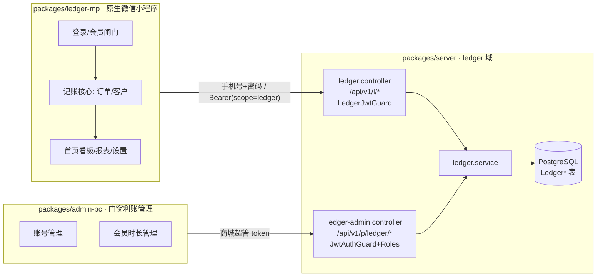
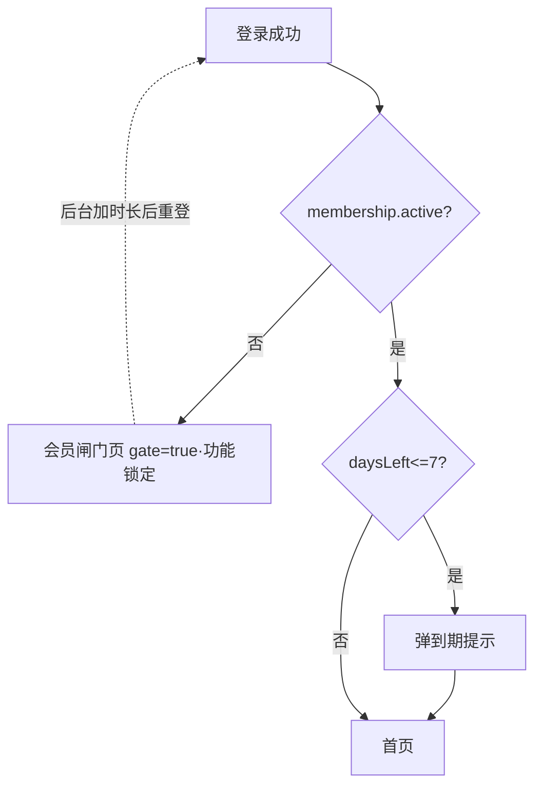

# DESIGN · 门窗利账（架构设计）

> 6A 阶段 2 Architect。基于 [CONSENSUS](./CONSENSUS_门窗利账.md)。

## 1. 整体架构



**隔离原则**：ledger 域与商城域共库不共表、共 JWT 密钥不共主体。商城零改动。

## 2. 后端模块结构

```
packages/server/src/modules/ledger/
├── ledger.module.ts
├── ledger.controller.ts          # App 接口 /api/v1/l/*（LedgerJwtGuard）
├── ledger-admin.controller.ts    # 后台接口 /api/v1/p/ledger/*（platform 角色）
├── ledger.service.ts             # 业务：账号/会员/订单/客户/统计
├── ledger-auth.service.ts        # 登录、签发 ledger token、改密
├── guards/ledger-jwt.guard.ts    # 校验 scope=ledger，挂载 req.ledgerUser
├── decorators/current-ledger-user.ts
└── dto/                          # login / order / customer / membership-grant 等 DTO
```

### 2.1 鉴权设计（关键集成点）

- ledger App 用户 token：`JwtService.sign({ sub: ledgerUserId, scope: 'ledger' })`，与商城共用 `JWT_SECRET`。
- 全局 `JwtAuthGuard`（商城用）当前对所有非 `@Public` 路由生效。ledger App 路由处理：
  - 方案（采用）：ledger App 控制器整体 `@Public()` 跳过全局守卫，再在控制器/方法上挂 `@UseGuards(LedgerJwtGuard)`。`LedgerJwtGuard` 校验 token 且要求 `scope==='ledger'`，查 `LedgerUser` 挂到 `req.ledgerUser`；顺带做**会员有效期校验**（过期返回业务码，App 据此进闸门）。
  - 反向保险：商城全局 `JwtAuthGuard` 里对 `scope==='ledger'` 的 token 视为无效主体（拒绝），防止 ledger token 越权访问商城接口。
- 后台 `/api/v1/p/ledger/*`：管理员是商城 `User`，走**现有**全局 `JwtAuthGuard` + `@Roles('platform')`（`super-admin` 经 `expandRole` 自动含 platform）。

## 3. 数据模型（Prisma，新增 `Ledger*`，同 `schema.prisma`）

```prisma
model LedgerUser {                      // 记账账号（后台创建）
  id           String   @id @default(cuid())
  phone        String   @unique         // 登录名
  passwordHash String
  nickname     String   @default("门窗店主")
  avatar       String?
  status       String   @default("active")   // active | disabled
  mustReset    Boolean  @default(false)       // 首登强制改密（可选）
  createdBy    String?                        // 操作管理员 User.id
  lastLoginAt  DateTime?
  createdAt    DateTime @default(now())
  updatedAt    DateTime @updatedAt
  membership   LedgerMembership?
  orders       LedgerOrder[]
  customers    LedgerCustomer[]
  goal         LedgerGoal?
}

model LedgerMembership {                 // 会员（1:1 账号）
  id          String    @id @default(cuid())
  userId      String    @unique
  user        LedgerUser @relation(fields: [userId], references: [id], onDelete: Cascade)
  expiresAt   DateTime?                  // null=从未开通；> now=有效；<= now=过期
  lastPlanKey String?                    // 最近一次套餐：day|week|month|quarter|year|custom
  updatedBy   String?                    // 操作管理员
  updatedAt   DateTime  @updatedAt
  logs        LedgerMembershipLog[]
}

model LedgerMembershipLog {              // 会员变更审计（每次增减时长一条）
  id           String   @id @default(cuid())
  membershipId String
  membership   LedgerMembership @relation(fields: [membershipId], references: [id], onDelete: Cascade)
  deltaDays    Int                       // +N / -N
  planKey      String?
  beforeAt     DateTime?
  afterAt      DateTime?
  operatorId   String?                   // 管理员 User.id
  note         String?
  createdAt    DateTime @default(now())
}

model LedgerCustomer {                   // 客户档案（按账号隔离）
  id        String   @id @default(cuid())
  userId    String
  user      LedgerUser @relation(fields: [userId], references: [id], onDelete: Cascade)
  name      String
  phone     String?
  address   String?
  note      String?
  createdAt DateTime @default(now())
  updatedAt DateTime @updatedAt
  orders    LedgerOrder[]
  @@index([userId])
}

model LedgerOrder {                      // 订单/账（按账号隔离）
  id          String   @id @default(cuid())
  userId      String
  user        LedgerUser @relation(fields: [userId], references: [id], onDelete: Cascade)
  customerId  String?
  customer    LedgerCustomer? @relation(fields: [customerId], references: [id])
  customerName String                    // 冗余客户名（兼容快速录入/删档）
  date        DateTime
  total       Int                        // 收款总价（分或元，统一元·整数）
  costProfile Int @default(0)            // 型材
  costGlass   Int @default(0)            // 玻璃
  costHardware Int @default(0)           // 配件
  costLabor   Int @default(0)            // 人工
  costScreen  Int @default(0)            // 纱窗
  extras      Json @default("[]")        // [{type,amount}] 其他开销
  note        String?
  createdAt   DateTime @default(now())
  updatedAt   DateTime @updatedAt
  @@index([userId, date])
}

model LedgerGoal {                       // 经营目标（1:1 账号）
  id       String @id @default(cuid())
  userId   String @unique
  user     LedgerUser @relation(fields: [userId], references: [id], onDelete: Cascade)
  monthly  Int @default(0)
  yearly   Int @default(0)
  updatedAt DateTime @updatedAt
}
```

> 金额一律「元·整数」（设计中无小数），避免分/元换算歧义；如需更稳可后续切 Decimal。
> 消息中心（NOTIFICATIONS）第一期可前端本地/派生，暂不建表（Phase 3 评估 `LedgerNotification`）。

## 4. API 契约

### 4.1 App 接口 `/api/v1/l/*`（LedgerJwtGuard，按账号 scope）

| 方法              | 路径                      | 说明                                                                                    |
| ----------------- | ------------------------- | --------------------------------------------------------------------------------------- |
| POST              | `/l/auth/login`           | 手机号+密码登录 `{phone,password}` → `{token, user, membership}`                        |
| POST              | `/l/auth/sms-login`       | 验证码登录（辅，可后置）`{phone,code}`                                                  |
| POST              | `/l/auth/change-password` | 改密 `{oldPwd,newPwd}`                                                                  |
| GET               | `/l/me`                   | 当前账号 + 会员状态                                                                     |
| GET               | `/l/membership`           | 会员状态（套餐/到期/剩余天数/状态）                                                     |
| GET               | `/l/orders`               | 订单列表（筛选：客户/日期区间/利润区间、分页）                                          |
| POST              | `/l/orders`               | 新增订单                                                                                |
| GET               | `/l/orders/:id`           | 订单详情                                                                                |
| PATCH             | `/l/orders/:id`           | 编辑订单                                                                                |
| DELETE            | `/l/orders/:id`           | 删除订单                                                                                |
| GET               | `/l/customers`            | 客户列表（含按订单聚合的统计）                                                          |
| POST/PATCH/DELETE | `/l/customers[/:id]`      | 客户增删改                                                                              |
| GET               | `/l/stats/overview`       | 首页看板（周期 month/quarter/year：利润/营收/成本/订单数/成本占比/高利润排行/利润趋势） |
| GET               | `/l/stats/monthly`        | 月度利润 + 人工序列                                                                     |
| GET/PUT           | `/l/goal`                 | 经营目标读/写                                                                           |

### 4.2 后台接口 `/api/v1/p/ledger/*`（JwtAuthGuard + Roles('platform')）

| 方法  | 路径                                   | 说明                                                             |
| ----- | -------------------------------------- | ---------------------------------------------------------------- |
| GET   | `/p/ledger/users`                      | 账号列表（含会员到期/剩余天数/状态，搜索分页）                   |
| POST  | `/p/ledger/users`                      | 建号 `{phone, password?, nickname?}`（password 缺省则生成默认）  |
| PATCH | `/p/ledger/users/:id`                  | 改资料/禁用启用 `{status?, nickname?}`                           |
| POST  | `/p/ledger/users/:id/reset-password`   | 重置密码 → 返回新密码                                            |
| POST  | `/p/ledger/users/:id/membership/grant` | **增加会员时长**：`{planKey? , days?, note?}` → 叠加，返回新到期 |
| GET   | `/p/ledger/users/:id/membership/logs`  | 会员变更记录                                                     |

## 5. 会员核心算法

```
预设套餐 PLAN_DAYS = { day:1, week:7, month:30, quarter:90, year:365 }

grant(userId, { planKey, days, note }):
  N = days ?? PLAN_DAYS[planKey]          // 二选一，优先 days
  before = membership.expiresAt
  base   = max(now, before ?? now)         // 叠加基准：未过期则从原到期续，过期则从今天起
  after  = base + N 天
  membership.expiresAt = after; lastPlanKey = planKey ?? 'custom'
  写 LedgerMembershipLog(deltaDays=N, before, after, operator)

deriveStatus(expiresAt):
  never  = expiresAt == null
  active = !never && expiresAt > now
  expired= !never && expiresAt <= now
  daysLeft = active ? ceil((expiresAt-now)/day) : (expired ? 负数 : 0)
  expiringSoon = active && daysLeft <= 7
```

**App 闸门流程**（对应设计 `screensAuth`/`screensMembership`）：



- 会员中心页「续费/开通」按钮：D3 无支付 → 改为提示「会员由管理员后台开通，请联系管理员」。

## 6. 屏幕清单（28 路由，源自 `门窗利账.html` SCREENS 映射）

| 分组      | 路由                                                                                                                                        | Phase |
| --------- | ------------------------------------------------------------------------------------------------------------------------------------------- | ----- |
| 鉴权/会员 | login, membership                                                                                                                           | 1     |
| 记账核心  | home, orders, orderDetail, orderEdit, customers, customerDetail, customerEdit, costAnalysis                                                 | 2     |
| 报表      | reports(利润/人工 tab), monthlyProfit, monthlyLabor, goal                                                                                   | 3     |
| 个人/设置 | profile, editProfile, accountSecurity, notifications, privacy, about, messageCenter, dnd, feedback, phoneBind, password, deleteAccount, doc | 3     |
| 导航      | 4 tab(home/orders/reports/profile) + 中心 FAB(新增订单)                                                                                     | 1–2   |

设计组件可复用清单（来自 `app/ui.jsx`/`charts.jsx`/`theme.jsx`，实现期逐一还原为小程序组件）：Screen/Header/Card/Button/Pill/Dot/Avatar/Money/Donut/Bars/Line/Switch/ListRow/Toast/ActionSheet/Segmented + Icon(line set) + 主题 token。

## 7. 异常处理策略

- 业务异常走 `BizException` + 统一响应壳；会员过期用专用业务码（App 据此路由到闸门，而非 401）。
- ledger token 越权访问商城接口 → 全局守卫拒绝；商城 token 访问 ledger App 接口 → `LedgerJwtGuard` 拒绝。
- 账号 `disabled` → 登录直接拒绝并提示。
- 数据隔离：service 层所有 `Ledger*` 查询强制带 `where userId = req.ledgerUser.id`，DTO 不接受 userId 入参。

---

**相关**：[CONSENSUS](./CONSENSUS_门窗利账.md) · [TASK](./TASK_门窗利账.md)
