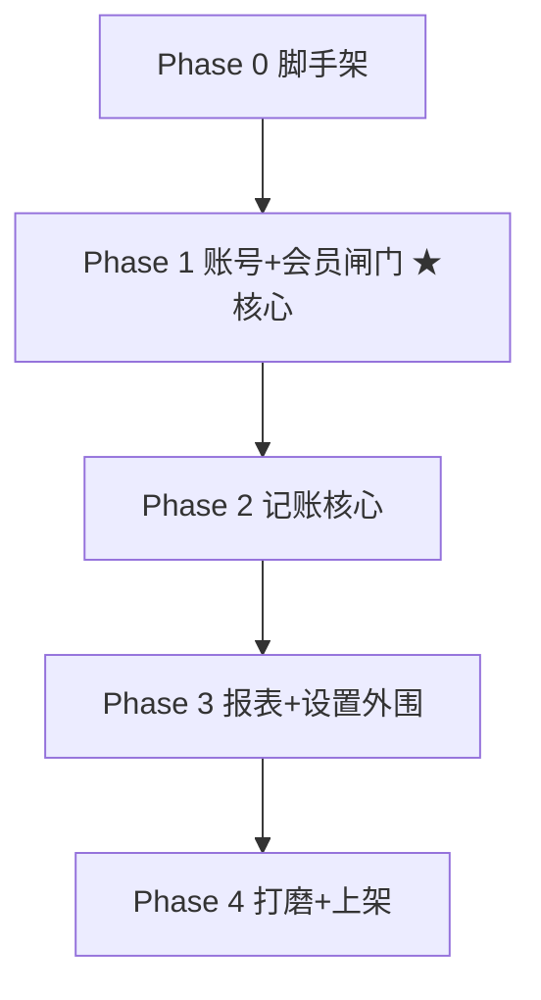

# TASK · 门窗利账（原子任务拆分）

> 6A 阶段 3 Atomize。基于 [DESIGN](./DESIGN_门窗利账.md)。每个任务标注 输入/产出/验收。

## 阶段总览 & 依赖

> **Phase 1 = 用户最在意的闭环**（后台建号/加时长 ↔ 小程序登录/闸门），作为第一交付里程碑优先打通。

---

## Phase 0 · 脚手架

- **T0.1 后端 ledger 域骨架**
  输入：DESIGN §2。产出：`modules/ledger/` 模块 + 空 controller/service + 注册到 `app.module.ts`。验收：`tsc` 通过，`/api/v1/l/ping` 200。
- **T0.2 Prisma 模型 + 迁移**
  产出：`schema.prisma` 增 `Ledger*`（DESIGN §3）；`prisma migrate dev --name ledger_init`；`prisma generate`。验收：迁移成功、Prisma Client 含新模型、商城表零变更。
- **T0.3 小程序新包骨架 `packages/ledger-mp`**
  产出：`app.json/app.ts/app.wxss`、`project.config.json`、4 tab 占位、主题 token（teal/Noto/浅色）、请求封装（baseURL + token + 统一壳解包）。验收：微信开发者工具可编译预览空壳。
- **T0.4 admin-pc 菜单骨架**
  产出：`views/ledger/`（account/membership 占位页）+ 路由 + 平台菜单项 + http api 文件。验收：超管登录可见「门窗利账」菜单并进入空页。

## Phase 1 · 账号 + 会员闸门（★核心里程碑）

- **T1.1 ledger 鉴权**（依赖 T0.1/2）
  产出：`ledger-auth.service`（bcrypt 校验、签 `scope:ledger` token）、`LedgerJwtGuard`（校验 scope + 挂 `req.ledgerUser` + 会员校验）、全局守卫对 ledger token 的拒绝保险。验收：错误密码/禁用账号拒绝；ledger token 调商城接口被拒。
- **T1.2 会员服务 + 算法**（依赖 T0.2）
  产出：`grant()` 叠加算法 + `deriveStatus()`（DESIGN §5）+ `LedgerMembershipLog`。验收：单测覆盖「未开通/有效续费叠加/过期从今起算/自定义天数」四类。
- **T1.3 后台管理接口**（依赖 T1.1/1.2）
  产出：`ledger-admin.controller` 全部 `/p/ledger/*`（建号/列表/改密/禁用/加时长/日志）。验收：Roles('platform') 守卫；建号→列表可见→加时长→到期更新。
- **T1.4 App 鉴权/会员接口**
  产出：`/l/auth/login`、`/l/me`、`/l/membership`、`/l/auth/change-password`。验收：登录返回 token+membership；过期返回专用业务码。
- **T1.5 admin-pc 账号管理页**（依赖 T1.3）
  产出：账号列表（搜索/分页/状态）、新建账号弹窗、重置密码、禁用启用。验收：全流程可操作，`vue-tsc` 干净。
- **T1.6 admin-pc 会员管理页**（依赖 T1.3）
  产出：账号会员状态列、增加时长弹窗（选套餐/填天数/备注）、到期与剩余天数展示、变更记录。验收：加时长后列表即时刷新。
- **T1.7 小程序 登录页**（依赖 T1.4）
  产出：`pages/login`（手机号+密码为主 / 验证码 tab / 微信入口占位），还原设计。验收：登录成功按会员状态路由。
- **T1.8 小程序 会员闸门/会员中心页**（依赖 T1.4）
  产出：`pages/membership`（gate 模式锁定 + 普通模式展示；套餐展示、权益、开通记录；「续费」改为联系管理员提示）。验收：未开通/过期进闸门；剩≤7天登录弹提示。
- **T1.9 小程序 个人中心会员卡 + 闸门联调**
  产出：profile 顶部会员卡（套餐/到期/剩余）；登录→闸门→（后台加时长）→重登进首页 全链路。验收：CONSENSUS §2「核心闭环」全部勾选。

## Phase 2 · 记账核心

- **T2.1 订单接口** `/l/orders` CRUD + 筛选 + 利润派生。验收：隔离测试（A 不见 B）。
- **T2.2 客户接口** `/l/customers` CRUD + 按订单聚合统计。
- **T2.3 统计接口** `/l/stats/overview`（周期聚合：核心指标/成本占比/排行/趋势）。
- **T2.4 小程序 首页看板**（环形/柱/折线 canvas 图）。
- **T2.5 小程序 订单列表/详情/新增编辑**（可选成本项网格 + 其他开销增删 + 实时利润 + 客户选择器）。
- **T2.6 小程序 客户列表/详情/新增编辑** + 下单回填。

## Phase 3 · 报表 + 设置外围

- **T3.1 报表接口** `/l/stats/monthly`（利润 + 人工序列）；目标 `/l/goal`。
- **T3.2 小程序 报表页**（利润/人工 tab）+ 成本分析 + 经营目标。
- **T3.3 小程序 个人中心 + 设置三级页**（账户安全/通知/隐私/关于/消息中心/反馈/协议页等，全链路闭环）。

## Phase 4 · 打磨 + 上架

- **T4.1** 深色模式 + 空态/错误态/加载态。
- **T4.2** 安全加固（限流、ledger JWT TTL、密码策略）+ 数据隔离回归测试。
- **T4.3** 小程序上架准备（AppID、合法域名、隐私协议、体验版）—— 列 TODO 待你提供资质。

---

## 质量门控（每 Phase 结束）

- 编译：server `tsc` + admin-pc `vue-tsc` 干净；ledger-mp 微信工具无报错。
- 隔离：商城无回归；ledger 数据按账号隔离测试通过。
- 文档：完成项回填 `ACCEPTANCE_门窗利账.md`。

**相关**：[ALIGNMENT](./ALIGNMENT_门窗利账.md) · [CONSENSUS](./CONSENSUS_门窗利账.md) · [DESIGN](./DESIGN_门窗利账.md)
